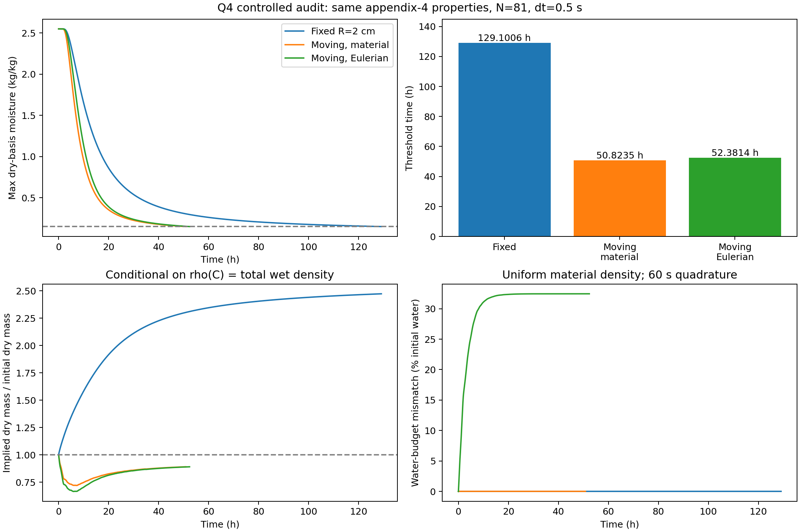

# Q4边界、ALE守恒与严格消融审计

日期：2026-09-10。基线为9d5098c，阶段公告759d790已先行推送。此次完成7组完整阈值轨迹、2组独立通量积分复核及针对性守恒测试。旧Excel保留为基线记录。**结论：暂不上8卡UQ；52.3814 h不能作为已经通过干基质量守恒审查的最终物理答案，50.8235 h是明确材料运动假设下的候选结果。**

## 1. 4 h后的边界依据

直接从[竞赛官网2026赛题发布页](https://www.mcm.edu.cn/html_cn/node/27b6e148f8113f09b0269f64a02629fb.html)下载其链接的赛题ZIP。官方包中的A题PDF、附件1、附件2与用户本地文件逐字节SHA-256一致，详见[source_evidence.json](source_evidence.json)。官方发布页本次读取未提供额外的后4 h边界说明；这不是对未来勘误不存在的断言。

核对范围包括PDF全部4页、嵌入附件、两个Excel的所有工作表、隐藏行列、定义名称、公式、批注、外链、ZIP成员及自定义属性。附件1只有一个可见Sheet1，241个数值样本，0—14400 s、间隔60 s；无隐藏行列、公式、批注、定义名称、外链。自定义属性和关系文件没有后续工艺曲线。PDF无嵌入附件。官方A题目录也未多出工艺说明。

题面描述“预热平衡和恒温干燥两个阶段”，附录1称附件1为“烘干初期”记录。这支持建立后期恒温情景，但**没有指定14400 s之后必须等于最后一次测量，也没有给出后期湿度恒定的明确值或延续公式**。

| 后4 h情景 | 温度 °C | 边界水分变量 kg/kg | 材料坐标Q4时长 h |
|---|---:|---:|---:|
| 最后测量值保持 | 50.165 | 0.04986 | 50.823472 |
| 最后一小时61点均值保持 | 49.998934 | 0.049987541 | 51.091285 |
| 名义平台保持 | 50 | 0.05 | 51.089861 |

三种情景在0—4 h都使用完全相同的PCHIP原始数据，之后才改变边界。最后一小时温度范围49.757—50.236°C，水分变量范围0.04975—0.05024；样本标准差分别0.154353°C、0.000150129 kg/kg。均值平台比单个末值更能代表已观测平台，可作为下一版明确标注的工作假设。**这些相邻平台的约0.268 h差异不是所有可能后期边界的置信区间。** 前4 h数据无法识别随后两天的控制策略；不能用小平台扰动代替这项结构不确定性。

此外，附件称烘房水分浓度为kg/kg，并未给相对湿度%。本模型直接将该量用于经验Robin差值。空气湿度比与药材干基含水率虽同为kg/kg，分母物质不同；若要求物理界面闭合，应说明平衡含水率/分配关系，或明确把现有Robin条件视为题目层面的有效经验边界。不能擅自换成RH或声称已经获得吸附等温线。

## 2. 变量和方程：符号正确不等于物理闭合正确

定义：r为当前物理半径坐标，R(t)为表面半径，ξ=r/R(t)，U(ξ,t)=C(r,t)。C是水质量/干固体质量；s是单位当前体积的干固体质量，v是固体径向速度，w=ξṘ是网格速度；j是相对固体的水质量通量，单位kg/(m²·s)。T的PDE可用°C温差，但Arrhenius公式必须使用T+273.15 K；代码已如此实现。

不流失干固体、无内部水源时，圆柱局部守恒为

\[
\partial_t s+\frac1r\partial_r(rsv)=0,
\qquad
\partial_t(sC)+\frac1r\partial_r[r(sCv+j)]=0.
\]

若采用相对通量闭合j=−sD∂rC，两式相减得到

\[
s(\partial_t C+v\partial_rC)=\frac1r\partial_r(rsD\partial_r C),
\]

其ALE形式为

\[
\partial_tU+\frac{v-w}{R}\partial_\xi U
=\frac1{sR^2\xi}\partial_\xi(\xi sD\partial_\xi U).
\]

表面随固体运动必须满足v(R,t)=Ṙ。中心对称；若以Ceq表示有效表面平衡变量，则j(R)=s(R)hm[Us−Ceq]，从而−D Uξ/R=hm[Us−Ceq]。hm单位m/s，乘s后才是水质量通量。该条件在s均匀且干固体质量恒定时给出严格水分总量预算。

**原代码解的是**

\[
U_t=\frac1{R^2\xi}\partial_\xi(\xi D U_\xi)
+\frac{\dot R}{R}\xi U_\xi.
\]

右侧正号来自固定物理坐标导数变换，符号没有写反。例如静止Eulerian场C=r²变为U=R²ξ²，恰有Ut=(Ṙ/R)ξUξ。收缩时Ṙ<0，干燥剖面Uξ<0，此项为正，会减慢局部U的下降。

但从固体质量方程看，上式相当于忽略干密度空间权重并令v=0；收缩的外边界于是扫过静止物质。它并不是自动成立的“药材固体一起收缩”模型。原FVM检查

\[
\frac d{dt}\left[R^2\int_0^1U\xi d\xi\right]
=-R h_m(U_s-C_{eq})+R\dot R U_s.
\]

最后一项是边界扫掠。这个量是**浓度的几何积分**，没有干密度权重，不能称为水质量。几何守恒、常数场保持和极小离散残差只能验证这条数值方程，没有证明干基物理模型成立。

## 3. 关闭ALE究竟代表什么

若采用固定长度、均匀径向收缩，则v=w，s(t)=s0[R0/R(t)]²。此时s在空间上均匀，材料导数中的相对速度为零：

\[
U_t=\frac1{R^2\xi}\partial_\xi(\xi D U_\xi),\qquad
\frac d{dt}\int_0^1U\xi d\xi=-\frac{h_m}{R}(U_s-C_{eq}).
\]

因此本次`ale=False, moving=True`是一个明确的材料坐标比较：保留当前R²扩散尺度和R边界面积，同时关闭网格相对输运及配套历史体积项，温度和水分两式一起改变。不能只删一个通量而留下历史体积，制造另一种非守恒方程。

它仍不是无条件最终闭合。附录4仅称ρ为密度。**若解释为湿料总密度**，则s=ρ/(1+C)=(760+90C)/(1+C)，与上述均匀运动推得的s(t)通常不一致。按全轨迹计算

\[
\frac{M_d(t)}{M_d(0)}=
\frac{R(t)^2\int_0^1\frac{760+90U}{1+U}\xi d\xi}
{R_0^2\frac{760+90C_0}{1+C_0}\int_0^1\xi d\xi}.
\]

材料坐标候选的这个比值最低约0.71990（7.2 h），终点约0.89034；原Eulerian模型最低约0.66471，终点约0.89034。固定半径反事实终点为2.47328。均不是不流失干物质应有的1。**这是“经验ρ按真实湿密度解释+当前模型轨迹+固定长度”的兼容性诊断，不是实验测得干物质流失。** 若ρ仅用作热方程的有效经验系数，可保留该用法，但须另外定义质量方程中的干密度并承认这种有效模型解释；若ρ必须作为真实密度，则需要重新闭合速度、体积/长度、密度与通量，而不是宣称删掉ALE就全部解决。

独立的水分预算也显示差别：以均匀收缩的恒定干质量为参照，将平均含水率下降与表面水分通量积分对比。每1 s输出的独立梯形积分，材料坐标终点偏差为初始水量的0.001984%，原Eulerian为32.43315%。后者代表在**材料运动解释下**遗漏的预算项，并非原Eulerian离散方程的求解残差。60 s输出复算得到0.015592%与32.44659%，表明大差异并非输出积分精度造成。

## 4. 129 h与52 h的严格分解

全部主对照使用附录4物性（`model=3`）、动态ρ/cp/k/D、相同初态、相同末值平台、相同hm/hT、81节点、BE、dt=0.5 s、相同Picard和阈值规则。没有把附录3的Q3当作Q4无收缩对照，也没有冻结物性。

| 对照 | R(t) | 相对网格输运 | 时长 h |
|---|---|---|---:|
| 固定半径 | 2 cm | 关 | 129.100608 |
| 固定半径开关恒等检查 | 2 cm | 开 | 129.100608 |
| 移动材料坐标 | 附件2 | 关 | 50.823472 |
| 原移动Eulerian | 附件2 | 开 | 52.381389 |

固定R时开关ALE的**全部保存温度/水分轨迹逐元素相同，最大差为0**。原移动Eulerian重跑复现旧基线52.3813889 h。

沿“固定→移动材料→移动Eulerian”这条明确对照路径：几何变化缩短78.277135 h；加入原相对网格输运增加1.557917 h；合计缩短76.719219 h。这是非线性模型的条件路径分解，不是与路径无关的线性贡献率；本轮没有进一步分别识别温度输运、水分输运、面积和扩散长度的独立贡献。

附件半径最终附近从2 cm降到1.2 cm，扩散尺度R²降至0.36倍，相同D下D/R²提高到2.778倍，单位体积侧表面交换hm/R提高到1.667倍。129.1×0.36≈46.48 h只是全程已缩小的扩散尺度估计；实际有早期收缩过程、非线性D和Robin边界，所以不能用它代替50.82 h求解，但它解释了差距量级。原41节点/2 s的129.1233 h与本次129.1006 h相差约0.0227 h，远不足以解释76.7 h差异。

材料坐标dt=1 s给50.823802 h，dt=0.5 s给50.823472 h，相差1.1875 s。事件括区宽0.0625 s仅是定位精度，不是总离散误差；本轮不把它当成物理预测精度。

## 5. 代码修正、验证与UQ决定

原`moving=True, ale=False`路径没有执行累计积分审计，却输出0。本轮修复为真实计算材料参考积分预算，并增加`balance_quantity`说明积分对象；明确内部残差不包含最后事件二分子步。主材料算例累计相对残差5.56×10⁻¹⁴。BE/BDF2收缩材料测试分别约3.05×10⁻¹⁵、1.44×10⁻¹⁴；三对角独立求解、圆柱Robin特征模态、非线性面通量求积与几何常数场测试均通过。边界新增显式`nominal`情景，并拒绝未知tail字符串，避免拼写错误默默选择均值。

**本轮决定：不启动大规模8卡UQ。** 尚待明确的是后期边界情景、Ceq与空气水分变量的对应，以及ρ/干密度/固体速度的质量闭合。这些是模型结构选择，增加参数样本不能消除。下一步应先在论文中明确有效经验模型或建立更完整质量模型，再针对所选模型做有依据的边界和物性不确定性分析。

性能也不支持立刻上8卡：本次CPU在81节点、0.5 s下单条移动轨迹约10—12 s，固定半径约24 s（首条含编译约31 s）。先前本机8条GPU参考实现约44.8 s、CPU同口径约0.832 s，仅证明当前小网格批量稠密GPU实现不合算；不能外推所有GPU实现都慢。若后续样本量确实需要，再优化批量三对角算法，以实际样本做吞吐基准，随后决定卡数。远程8卡没有启动，也没有性能实测。

## 6. 复现和证据

在仓库根目录运行（数值Python需numpy/scipy/numba/matplotlib）：

```powershell
& 'D:/Anaconda3/envs/torchgpu/python.exe' A_model/audit/run_audit.py
& 'D:/Anaconda3/envs/torchgpu/python.exe' A_model/audit/summarize_audit.py
& 'D:/Anaconda3/envs/torchgpu/python.exe' A_model/tests/test_solver.py
```

来源核对脚本`audit_sources.py`需openpyxl/pypdf及manifest指向的用户原件，读取临时目录的官方ZIP；不会修改原件。公开JSON保留哈希及结构核查，不复制完整题面。数值复现仅依赖仓库内CSV。

- [完整实验元数据](results.json)、[对照表](summary.csv)、[源码哈希与恒等检查](verification.json)、[独立预算和边界统计](diagnostics.json)。
- 每个NPZ的`data`列为时间s、半径m、81列温度°C、81列干基含水率；对应`*_budget.csv`保存干质量兼容性与水预算诊断。图中预算曲线使用60 s输出积分，精细1 s终点复核见diagnostics。
- [原始来源核查](source_evidence.json)。方程以上述两条质量守恒律直接推导；不同文献中的体积分数、湿基含水率、干基含水率不可互换。


