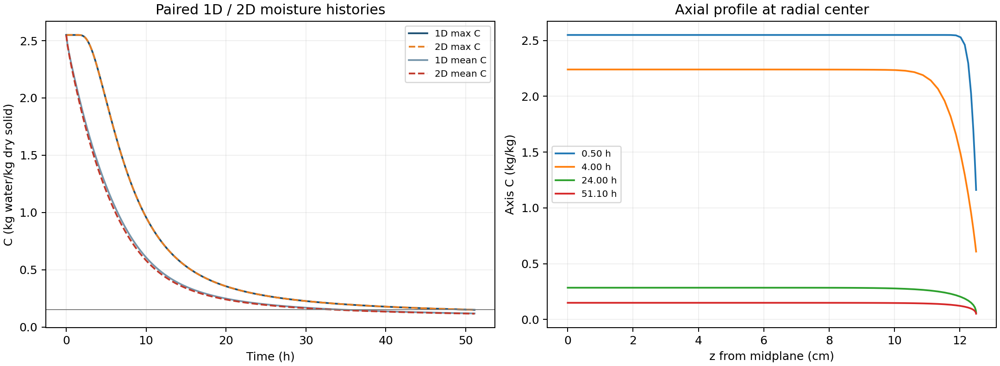

# Q4 轴对称端面验证

本验证服务于“规定半径、均匀径向随体变形、独立干固体守恒、经验有效热物性、末小时均值平台”这一条件明确的 Q4 工程模型。它没有替换冻结主结果，也没有把附件没有给出的端面传递规律当作已知事实。

## 对照假设与方程

取轴向半域 `0 <= z <= H=L/2=0.125 m`，中截面 `z=0` 对称；径向用随体坐标 `xi=r/R(t)`。长度固定，径向均匀形变的固体速度与网格速度相同，故没有相对网格输运项。二维水分方程为

\[
 C_t=\frac{1}{R(t)^2\xi}\partial_\xi(\xi D C_\xi)
     +\partial_z(D C_z).
\]

温度方程在同一算子中用有效体积热容 `rho_eff(C)*cp(C)` 乘时间导数、用 `k(C)` 替代扩散系数。物性、径向半径插值、外部边界插值和均值平台全部复用主程序；模型编号为 `MODEL_Q4=4`。水分各面的扩散系数使用主程序相同的八点 Gauss Kirchhoff 积分，导热系数使用调和面均值。

侧面沿用主模型的经验 Robin 边界。**对照中的两个端面也采用相同的 `hT=25 W/(m² K)`、`hm=8e-7 m/s` 和相同烘房变量。** 这是为了量化在明确端面暴露条件下的影响；题目没有单独给端面系数。水分边界仍采用等效平衡变量 `Ceq=Cair`，不把空气与干料两种质量基准当成同一物理量。

## 守恒分母

径向控制体权重 `vr_i=(xi_face_right²-xi_face_left²)/2`，轴向权重 `vz_j=z_face_right-z_face_left`。半域参考积分为

\[
 V_{ref}=\sum_{ij}vr_i vz_j=\tfrac12 H.
\]

独立干固体密度满足 `s(t)R(t)^2=s0 R0^2`。全柱干质量为 `Md=4*pi*s(t)*R(t)^2*Vref`，因此水质量除以干质量恰好为

\[
 \overline C=\frac{M_w}{M_d}
 =\frac{\sum_{ij}vr_i vz_j C_{ij}}{V_{ref}}.
\]

程序累计的侧面损失速率和端面损失速率分别为

\[
 F_s=\frac{h_m}{R V_{ref}}\sum_j vz_j(C_{side,j}-C_{eq}),\qquad
 F_e=\frac{h_m}{V_{ref}}\sum_i vr_i(C_{i,end}-C_{eq}).
\]

逐步和全程检查 `Cmean_new-Cmean_old+dt*(Fs+Fe)=0`。完整圆柱的两个端面、周向 `2*pi` 和对称半域的倍数已经在分子分母中消去；这里不会误用几何积分 `R²*C` 作为守恒干基水量。统计包括最后一次事件二分得到的实际短步。

## 离散与实验

采用全隐式后向 Euler、Picard 迭代和稀疏直接线性求解。径向为均匀节点；轴向采用 `z=H*[1-(1-u)^2]`，`u` 均匀分布，在端面加密。收敛准则与主程序相同：温度迭代差小于 `1e-7 K`、含水率迭代差小于 `1e-9`。

1. 关闭端面传热传质：`Nr=41, Nz=9, dt=30 s`，与相同径向网格、步长的完整 1D 轨迹比较，核验二维退化。
2. 端面开放粗级：`Nr=41, Nz=25, dt=30 s`，端面最小轴向间距约 `0.217 mm`。
3. 端面开放细级：`Nr=81, Nz=37, dt=15 s`，端面最小轴向间距约 `0.0965 mm`。

每个开放级别都另跑完全相同径向网格和步长的 1D 对照。比较采用配对差值；不能把二维较大步长产生的绝对时间偏差错算成端面效应。代表时刻为 `1800 s、14400 s、86400 s` 及各自的全域最大含水率达标时刻。初始场也保存在 NPZ 中。

结果写入 `results/endface_summary.json`、`results/endface_summary.csv`，各场景 JSON 中保留积分预算与事件区间，NPZ 中保留代表时刻的完整二维场、参考积分权重和每 600 秒的历史。汇总文件还记录本脚本、物性、边界、1D 求解器及两个输入 CSV 的 SHA-256。

## 复现命令

在 `A_model` 目录使用项目数值 Python 依次执行：

```powershell
python validation/endface_benchmark.py --nr 41 --nz 9 --dt 30 --label closed --closed-ends --paired-1d
python validation/endface_benchmark.py --nr 41 --nz 25 --dt 30 --label coarse --paired-1d
python validation/endface_benchmark.py --nr 81 --nz 37 --dt 15 --label fine --paired-1d
python validation/endface_benchmark.py --summarize
```

这是少量确定性端面对照。它没有开展 UQ，没有重新标定物性或传递系数，也不能证明其他端面边界、轴向形变或其他长径比的影响可忽略。


## 实际结果与解释

| 场景 | Nr × Nz | dt/s | 配对1D时间/h | 2D时间/h | 2D−1D/s |
|---|---:|---:|---:|---:|---:|
| closed | 41 × 9 | 30 | 51.117887370 | 51.117887370 | 0.000000 |
| coarse | 41 × 25 | 30 | 51.117887370 | 51.117887370 | 0.000000 |
| fine | 81 × 37 | 15 | 51.100830078 | 51.100830078 | 0.000000 |

关闭端面的完整二维场与重复的配对 1D 场一致：代表时刻及事件时刻最大温度差 1.954e-12 K，最大含水率差 4.485e-14 kg/kg；事件时间一致。

细级开放端面对照如下。平均量采用干固体质量归一化，所有表中比较都在相同时刻进行。

| 时刻/h | 1D max C | 2D max C | 1D mean C | 2D mean C | 均值相对改变 |
|---:|---:|---:|---:|---:|---:|
| 0.500000 | 2.550000000 | 2.550000000 | 2.343833538 | 2.328742685 | -0.6439% |
| 4.000000 | 2.240586397 | 2.240585261 | 1.422990553 | 1.378698070 | -3.1126% |
| 24.000000 | 0.285163861 | 0.285163786 | 0.205414080 | 0.199312296 | -2.9705% |
| 51.100830 | 0.149999995 | 0.149999979 | 0.118348152 | 0.116078002 | -1.9182% |

细级全程归一化水质量预算最大相对误差为 5.606e-14（包含事件短步）；累计端面排水占全部排水 3.9032%。粗、细级终态平均 C 的配对改变量分别为 -0.002282067、-0.002270150 kg/kg。

较大步长的细级配对 1D 时间比主结果 51.091284722 h 晚 34.363 s。这一绝对差主要属于所用离散设置，不能解释为端面影响，二维数值也没有替换主结果。

两个分辨率的配对事件结果应结合各 JSON 中的事件括区读取。若括区重合，只表明当前离散问题没有分辨出相应尺度的时间变化；这不是连续 PDE 端面误差的严格上界，也不消除剩余网格、时间步、外部边界与端面参数的不确定性。

**在本例规定长度、均匀径向形变和相同端面 Robin 参数下，端面对全域最大含水率达标时刻的影响很小；但对平均含水率和端部局部温湿场有可见影响。** 因此本验证支持针对中心阈值时间使用 1D 近似，不能支持“整个温湿场的端面误差均可忽略”。


