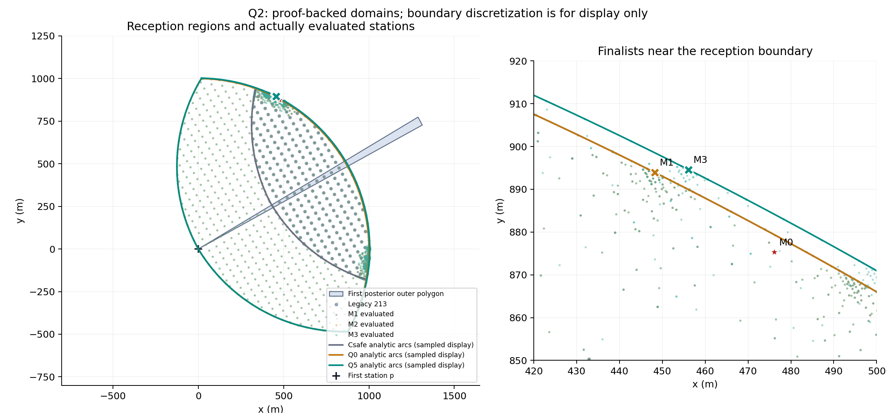
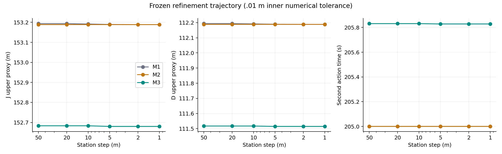

# Q2 首次接收信息与外层站位细化结果

任务：Q2_RECEPTION_AWARE_OUTER_REFINEMENT。起点7c90ba1，Q2稳定直径修复a136c1a，
实验冻结fdbf10640773f6f7a4fbfa0f4c429b7b4981557b。仅本地几何计算。
官方接口调用、演练启动、正式测试启动均为0。最终配置和论文正文未自动替换，也不自动推送。

## 结论与采用决定

旧213候选与赢家成功复现。旧1000m圆盘交严格偏保守，但安全域扩大不意味着
目标函数一定大幅改善。本轮原域加密使J降低约0.59517m；加入Q0未得到超出数值
不确定度的额外改善；利用direction的r>5后，四圆盘Q5再降低约0.50826m。
总改善约0.71755%，低于运行前冻结的1%采用门槛。决定为
**SAFE_INNER_DOMAIN_REFINEMENT_REVIEW_ONLY**：建议补充Q2候选域论证和消融结果，
保留旧默认，不把本例结果推广为任意首测最优。

## 同口径对照

下表全部使用新的最终.001m角度数值审核，lambda=.2m/s、T=移动/5+第二检测5秒。
D与J列为数值包络上值，不是严格区间算术认证的连续supremum。实际误差范围见原始
finalists.csv的上下值；这里坐标为展示精度，复现使用CSV完整精度。

| 组别 | 第二站位 (m) | D上值(m) | T(s) | lambda*T(m) | J上值(m) |
|---|---|---:|---:|---:|---:|
| M0：旧213 | (476.121593,875.333210) |112.920613|204.288735|40.857747|153.778360|
| M1：旧Csafe加密 | (448.183969,893.941332) |112.183192|204.999998|41.000000|153.183192|
| M2：Q0加密，保留M1池 | (448.184412,893.941110) |112.183153|204.999998|41.000000|153.183153|
| M3：Q5加密，保留M1/M2池 | (456.129418,894.565113) |111.509258|205.828363|41.165673|152.674931|

旧15情景原值D=112.91970641098385m、J=153.77745346221593m；稳定all-pairs
修复后全部213候选评分与原值差<1e-10m，赢家不变。它与上表连续角度审核是不同
评分近似精度，不能把差异算成站位优化收益。主比较M0→M1→M3使用同一内层数学定义。

* M0→M1：J降低0.59516886m（0.38703%），D降低0.73742132m，T增加0.71126229s。
* M1→M2：上值差仅0.00003866m，.001m审核包络重叠，**NUMERICALLY_INDISTINGUISHABLE**。
  这不是“三圆盘没有扩大几何域”，而是扩大后未找到可分辨的额外评分收益。
* M1→M3：J降低0.50826101m（相对M1约0.33180%），D降低0.67393415m，T增加0.82836570s。
* M0→M3：J降低1.10342986m，D降低1.41135546m，T增加1.53962799s。
  新点不是更快到达；改善来自几何项超过增加的移动惩罚。

M0与M3的最终数值J区间分别为[153.77742450,153.77836044]与
[152.67397030,152.67493058]，相隔约1.10249m，远大于本次数值细分间隔。
这支持在既定后验代理下找到更优站位，不构成严格FP误差证明或真实定位误差保证。

## 安全域与最终候选

Qvis=∩B(g,max(1000,|g-p|))的充要条件、凸性、p属于Qvis、外包导致保证域缩小，
均见独立证明。一般可变半径不允许仅查多边形顶点，已保留两组反例及刚体变换测试。

Q0对0<=alpha<90°且Rmax>=1000的完整放宽扇形精确；对真实相容域是安全内集。
alpha=90°退化为p；超90°存在反例并拒绝。首测direction可利用r>5：在本例目标圆
未裁剪环扇形时Q5有精确四圆盘表示。一般裁剪域未实现完整判定，标记
STOP_M3_GENERAL_CLIPPED_UNCERTIFIED。当前M3不是一般浮点外包多边形Qvis的求解器。

M3表中最终完整坐标为 **(456.1294178636005, 894.5651129169396)m**，距旧赢家
27.74082130m；在Q5内，在Csafe与Q0外。最近Q5边界距离的FP64估计为
0.00002929254m，硬验证使用有理数区间距离平方上界，未用正容差放宽半径。
M1/M2边界余量约0.000012254m。窄余量要求使用记录的完整坐标和证书；不据此授权实机动作。

所有实际评分点重新通过Q5硬验证，相关旧域点也通过旧域验证。最终8次细角审核点
另以独立80位Decimal泰勒计算交叉核对F(q)，保存最坏有界相容位置见证；此高精度
交叉检查不替代严格区间证书。r=5见证标为闭包supremum，不混淆为实际r>5源真值。
所有最终点的near后验均为空；评分器对其他点仍显式记录near后验直径<=10m，
方向代理保留原外包的保守位置。p原地重复保留首测信息，不生成新的独立误差样本。

## 搜索覆盖、收敛与预算

固定213点作为种子；局部粗网格x=0:50:1500，y=-1000:40:1000；top5起点间距
至少50m；50/20/10/5/2/1m多尺度内部和圆弧边界细化。M2/M3保留已认证旧池，
仅保证已评价候选池不丢弃旧优点，不是连续全局保证。

每层完整收敛表见[convergence.csv](results/q2_reception_outer_20260911/convergence.csv)。
M1/M2/M3最终2→1m层的J变化均约-7.4到-7.7微米，坐标变化约0.0001m，
满足预先冻结的.05m、2m稳定判据。半步.5m复查也仅改变约0.0001m，评分变化
小于.001m内层不确定度。这些微小变化主要来自圆弧投影的内退处理；只能说明
本搜索返回点稳定，不能以此认证局部最优或空间搜索穷尽。

半步最优点为(456.12950316432864,894.5650697228732)m，J数值上值152.67492316m，
与表中M3无法数值区分，因此不把它包装为另一项改进。

| 模式 | 累计不同站位 | 本模式新增.01m评分 | 搜索墙钟(s) |
|---|---:|---:|---:|
| M0 |213|213|1.891|
| M1 |797|584|4.820|
| M2 |1636|839|7.110|
| M3 |2108|472|3.909|

跨模式缓存复用完整相同站位，不能把累计池大小相加当计算次数。扩大组M2+M3搜索
评分共1311次，旧域M1为584次，算力并不相等，表中明确记录；结构相同，未声称等预算最优。
含半步与最终.001m审核，B组608次、C组合计1349次，均小于2000；A组215次。
主运行2164个唯一缓存评分加8次细角复查，共2172次；预算不含预先3个旧点开销测量。
整个主运行20.874s，远低于45分钟预算；停止原因为到达1m与完成半步复核，并非预算耗尽。

## 验证与证据

25项可执行回归全部通过，覆盖直径病态点、原213复现、圆盘关系、near/direction、
指定顶点反例、旋转平移、角度跨零、r=5/1000/1500、相切内外扰动、非法输入、
UNRESOLVED、原地重测与密集数值找错。原始轨迹的站位、接收证书、J/T及赢家
从CSV独立复算；全部缓存角度叶区间检查连续覆盖0–360°。主运行最大后验裁剪残差
5.68435e-13m。随机测试只找反例，未代替连续证明。

受保护的已有Python/CUDA等代码与旧Q2结果SHA256前后一致；questions.py仅Q2路径
使用稳定直径，solve_q1的AST指纹不变。Q3/Q4/MEC/diagnostic v1/grid_v1/D1未改。
原有A题等脏文件保留，完整起始清单随证据保存。

证据目录：[results/q2_reception_outer_20260911](results/q2_reception_outer_20260911)。
包括plan/environment/FROZEN、所有候选与细化CSV、角度叶区间、证书、最坏见证、
acceptance.json、测试日志、受保护文件哈希及可复现图。原始运行在J盘，仓库内为独立副本。




## 最小复现

在仓库根目录、已有torchgpu环境运行；输出目录必须不存在：

```powershell
& 'D:\Anaconda3\envs\torchgpu\python.exe' B_solver/tests/test_q2_continuous_search.py
& 'D:\Anaconda3\envs\torchgpu\python.exe' B_solver/q2_continuous_search.py --output 'J:\2026B_experiments\q2_reception_repeat'
```

单独旧213模式使用`--q2-candidate-mode legacy_213`。不要运行questions.py的总入口
来复现本轮，以免覆盖历史结果。图表可从保存数据用q2_outer_report.py重新生成。
正式测试启动次数=0；本轮完成后停在人工审核点。
