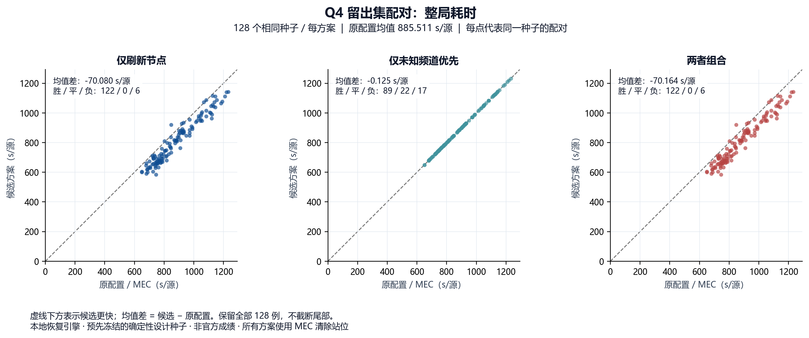
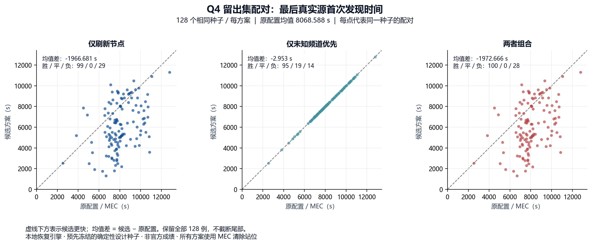

# Q4 发现调度：本地对比结果与采用结论

2026-09-11，执行代码冻结于 `1cf0b3d42f3d239d9e756ad3b4599c5eb55eecc8`。

**MEC 继续作为默认清除策略；下一轮 Q4 研发以“定位后刷新剩余节点”为主候选。** 该候选在新留出集平均快 **70.080 s/源（7.914%）**，最后源首次发现平均早 **1966.681 s（24.375%）**；但两项指标都有配对退步，不作整局确定不劣承诺。原启动默认保留，候选通过配置 `configs/q4_p4_diag_v1_grid_v1_refresh.yaml` 显式启用。

未知频道优先的独立收益仅 **0.125 s/源**，组合相对仅刷新再快 **0.084 s/源**，当前不值得围绕它继续调参。NCCP、segment_entry 和 Clearance Gap 保留为论文消融、负结果与边界材料；参数和定位评分均未改动。恢复桥审计结论为 **STOP**，未实现桥接代码，也未为它新增运行。

## 实验与完整性

先提交代码，再冻结全新 160 个确定性 SHA256 种子。开发 32 例和留出 128 例在查看候选结果前同时冻结；每例四个配置，**640 次完整 Q4 运行，640/640 全清除，异常、协议失败、超时均为 0**。开发仅作完整性门禁，两批分别统计，没有据开发成绩改参数。旧 519 例只读成本审计不计为新增运行；本轮没有新 Q3 案例。

全部运行直接调用用户提供的本地 `G:/QQ/jammers_linux` 核心，CPU、每次独立子进程。现实预算 1200 s、虚拟预算 360000 s；正式测试启动 **0** 次。这些设计种子不是官方场景或 IID 抽样，经验分位数不是总体长尾保证。

独立复核通过：28,800 次节点访问、310,990 次节点频道义务、8,372 次证书快照真实源包含性与严格站位认证；640 条原始轨迹和结果行一致。完整 102 项测试通过，默认执行流程的 AST 审计通过。没有声称重建了每一次中间观测后的全部硬域。

## 新留出 128 例：整局耗时

单位为每例虚拟总秒数除以该例真实源数，再对案例取统计量。四种方案均采用 MEC；45 个原覆盖节点不变，每个节点的全部未清频道扫描义务保留。

| 方案 | 平均 s/源 | P50 | P95 | P99 | 最大值 | 对基线胜/平/负 |
|---|---:|---:|---:|---:|---:|---:|
| 原调度 | 885.511 | 858.036 | 1144.112 | 1216.460 | 1232.267 | — |
| 仅刷新剩余节点 | **815.430** | 809.357 | **1083.082** | **1132.971** | 1141.416 | **122/0/6** |
| 仅未知频道优先 | 885.385 | 857.882 | 1143.812 | 1216.406 | 1232.067 | 89/22/17 |
| 两者组合 | 815.347 | 809.437 | 1082.982 | 1133.044 | 1141.216 | 122/0/6 |

开发 32 例也全部通过：原调度 888.545、仅刷新 813.730、仅未知优先 888.442、组合 813.605 s/源。这里只确认方向一致，不将开发和留出合并冒充更大的独立验证。

## 新留出 128 例：最后真实源首次发现

这是全部真实源第一次返回 direction/near 的最晚完成时刻，单位是整场虚拟秒，不除以源数，也不是最后扫描或最后清除时刻。真实源集合仅供 evaluator 计算指标，不传入调度策略。

| 方案 | 平均 s | P95 | P99 | 最大值 | 比基线更早/平/更晚 |
|---|---:|---:|---:|---:|---:|
| 原调度 | 8068.588 | 10622.431 | 11013.776 | 12794.839 | — |
| 仅刷新剩余节点 | **6101.907** | 9578.646 | 10796.258 | 11320.215 | **99/0/29** |
| 仅未知频道优先 | 8065.635 | 10616.731 | 11012.966 | 12789.839 | 95/19/14 |
| 两者组合 | 6095.922 | 9574.846 | 10794.068 | 11317.215 | 100/0/28 |

仅刷新方案平均明显提前，但 **29/128 例更晚，最大延迟 3373.149 s**。优化整条剩余开路径不等于优化发现前缀，这一限制必须保留。

## 收益来自哪里

在同一留出集，刷新使 discovery 每例平均时间由 **9406.777 降至 8707.903 s**，其中移动由 **6508.598 降至 5857.707 s**；平均扫描次数由 **489.484 降至 481.266**。扫描次数减少来自清除时机改变后已清频道被正常跳过，没有删除未知或已知未清频道的扫描。

最小代码改变是：每次 localize 返回后，从实际当前位置对剩余节点复用现有 route（近邻与三轮 2-opt），只有完整剩余开路径严格变短才替换旧顺序。原 local/explore 比较公式、定位、粒子、no_signal、MEC 和 optical fallback 均保留。其入口队首变化会影响原调度比较的结果，不能将其误解为强行保持后续动作不变。

2×2 因子分解给出整局节点主效应 −70.060 s/源、频道主效应 −0.104 s/源、交互 +0.042 s/源。这里是四个冻结配置的配对描述，不是总体因果或最优性证明。

全部真实源发现后的扫描反而由 **3060.807 增至 3988.320 s**。这主要反映发现得更早，不是总耗时恶化；该阶段仍承担未排除频道的覆盖义务，不能用事后真值截断退出。

## 必须随收益一起保留的案例

以下 seed 为留出内编号，SHA 派生序号为 seed+32；完整十六进制种子、逐阶段账本和首次动作分歧见 [CASE_AUDIT.json](results/recovered/discovery_20260911_summary/CASE_AUDIT.json)。均为已有轨迹只读分析，没有追加运行或调参。

| 留出 seed | 场景 | 仅刷新整局变化 | 最后发现变化 | 含义 |
|---|---|---:|---:|---|
| **42** | 13 源，10 定向 | **+71.543 s/源** | +1157.390 s | 最大整局回退 |
| **107** | 12 源，5 定向 | −67.187 s/源 | **+3373.149 s** | 整局更快仍可更晚发现最后源 |
| 66 | 16 源，7 定向 | −160.406 s/源 | −4412.265 s | 最大整局收益 |

seed 42 的首次动作分歧发生在第 42 个动作（从 0 编号）：清除频道 6 后，旧策略继续定位频道 15，新策略先扫 `(0,700)`。发现移动少了 **730.526 m**，但更多频道保持未清，discovery 扫描由 **494 增至 647 次**：测量增加 765 s、切频增加 153 s；再多出 371.400 s diagnostic。两者均无 optical fallback，clear attempt 均为 13。它说明剩余路程筛选忽略了沿途未清频道数量和清除时机，不能把局部距离优势提升成整局保证。

seed 107 的最后发现由 **4497.430 变为 7870.579 s**，但整局仍由 **929.975 降至 862.787 s/源**。两项优化目标真实存在冲突；不能以整局改善隐藏发现延迟。

## 恢复桥为何停止

现有接口没有纯移动命令。提前清除后再返回原 MEC，三角不等式说明移动收益已经耗尽，额外 clear 至少再花 3 s，measure 至少再花 5 s；时钟、历史和动作记录也不能恢复。直接接原下一动作存在条件性的两段距离关系，但需要冻结原 continuation、处理微秒舍入和预算，现有代码并不满足要求。详见 [严格状态耦合审计](STATE_RESTORING_BRIDGE_AUDIT.md)。本轮没有扩建双位置规划器。

## 后续研发范围与复现

后续主候选使用“仅刷新节点”，继续保留原调度对照。下一步应针对 seed 42 的**剩余扫描工作量与清除时机**、seed 107 的**发现前缀**建立新冻结消融；不继续调 NCCP，不因最后源事后已出现而跳过任何节点或频道。本批留出已被查看，之后不能重复作为新方案的独立留出。

入口：[原始汇总与配对表](results/recovered/discovery_20260911_summary/RESULTS.md)、[独立审计](results/recovered/discovery_20260911_summary/AUDIT.json)、[实验计划](Q4_DISCOVERY_PLAN.md)、[旧519例发现成本审计](Q4_DISCOVERY_BASELINE_AUDIT.md)。

原始完整证据在 `J:/2026B_experiments/discovery_20260911`。B题完整审计包为 `交付包/2026B_Q4发现调度_640次与恢复桥审计_1cf0b3d.zip`，含冻结代码、三文件原引擎、160 场景、640 条 row/trace、CSV、图表、审计和复核说明；包外 SHA256 与独立 ZIP 验证回执随附。

