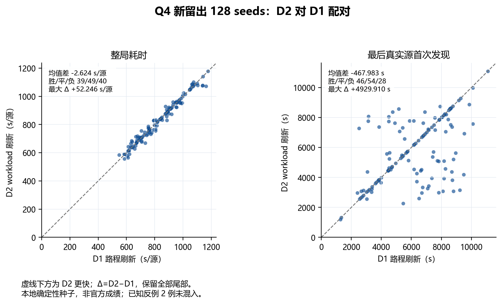

# D2扫描负担代理：完整结果与停止决定

2026-09-11，执行核心冻结于 `dcb62ac`。**停止这一版 D2，不继续调权重；Q4 主候选保持 MEC + diagnostic v1 + D1定位后路线刷新。** D2 在新留出集平均仅比 D1 快 **2.624秒/源（0.316%）**，未达到运行前写定的1%门槛。P95、P99有所改善，仍应如实保留，但不能在看完结果后改换采用标准。

这次建议的研发方向值得验证：两个已知反例的最后发现均提前，42的整局改善，107的整局略慢。新留出表明，当前“首个未来signal后退休”的简化代理还不足以带来明显整局收益。它不是所有扫描负担模型无效的证明，也不能由已有实验断言路径优化已经达到最优。

## 本轮完成情况

- 新160个确定性种子：开发32×3=96次，留出128×3=384次，共480次完整新Q4运行；与此前935个已用种子零重叠。
- 旧discovery留出42、107另行重跑三方案，共6次，单列已知反例。**本轮合计486次完整本地运行，486/486全清除，异常/协议失败/超时均为0，正式测试0次。**
- 三个集合、三配置及源码在D2完整案例结果出现前同时冻结。开发及已知反例只作完整性门禁，没有调参；留出按同一版本全部完成。
- 113项算法与回归测试通过，另4项报告检查通过。独立核对21,870次节点访问、234,776次频道义务、6,264条多边形清除证书、4,118个D2评分事件；其中400次偏离D1的距离选择。
- 两个已知反例中的D0/D1共4条新轨迹，其动作、目标日志、阶段账本及规定物理指标与旧轨迹完全一致；这4次对照已包含于6次已知反例运行，不另加计数。

## 三方案只差什么

| 方案 | 内容 |
|---|---|
| D0 | diagnostic v1 + 原发现调度 |
| D1 | 定位返回后，以实际位置比较原缓存路线和现有route生成的路线，选择更短者 |
| D2 | 完全相同的两个候选，加入现有合法粒子的扫描负担代理；只有代理负担与移动合计评分均优于D1选择时改选 |

没有扩大2-opt搜索，没有增加位置—频道自由调度。45个节点、每点全部未清频道义务、频道顺序、MEC、粒子更新、no_signal、定位与diagnostic评分、光学兜底均固定。D2允许较长路线交换较小代理工作量，不能沿用D1的同状态移动长度不增加性质。

## 新留出128例：整局时间

单位为每例虚拟总秒数除以该例真实源数，再对案例取统计。该新集合的D1均值830.168与上轮815.430来自不同种子，不能直接当成算法退步。

| 方案 | 均值 s/源 | P50 | P95 | P99 | 最大值 |
|---|---:|---:|---:|---:|---:|
| D0 | 911.224 | 922.001 | 1182.216 | 1250.270 | 1255.497 |
| **D1** | **830.168** | **815.907** | 1094.799 | 1157.095 | 1177.911 |
| D2 | 827.544 | 828.902 | 1081.717 | 1130.871 | 1177.911 |

D1对D0平均减少81.056秒/源，127胜、1负，再次支持保留D1。D2对D1则为 **39胜、49平、40负**，平均仅减少2.624秒/源；最大配对退步 **+52.246秒/源（留出seed76）**。分位数是线性经验值，不提供总体长尾保证；分位数之差也不等于配对差的分位数。

运行前门槛逐项判定：完整性通过；P95不增加通过；P99不增加通过；**平均下降至少1%未通过**。最终审计记录为 `STOP_D2_NO_PARAMETER_SWEEP`。

开发32例中D1为793.894、D2为787.704秒/源，D2减少6.190秒/源；已知两反例的收益更大，但均未用于替换新留出或补调参数。

## 最后真实源首次发现：平均提前仍有退步

单位为整场虚拟秒，不除以源数。真实源集合只供evaluator计算，不进入调度策略。

| 方案 | 均值 s | P95 | P99 | 最大值 |
|---|---:|---:|---:|---:|
| D0 | 8209.347 | 10311.712 | 10766.416 | 11253.637 |
| D1 | 6173.767 | 9269.798 | 10098.580 | 11092.370 |
| D2 | 5705.784 | 8713.711 | 9791.790 | 11092.370 |

D2对D1平均提前 **467.983秒**，46例更早、54例相同、28例更晚；最大延迟 **4929.910秒（留出seed6）**。该例整局反而快19.662秒/源，继续证明整局时间与最后发现是不同目标。本轮按计划将最后发现作为辅助风险，不为这一平均改善改变主门槛。

## 测量确实减少，为何总收益仍很小

留出中，总测量数平均 **500.016→482.211**，切频数 **458.234→440.297**。这些真实动作减少合计省约 **106.96秒/局**；总移动却平均 **36998.131→37390.297米**，多花约 **78.43秒/局**，抵消了大部分收益。最终平均整局只减少28.481秒。每源统计先按各例源数归一，其均值不是用整局均值再除以平均源数。

discovery平均时间 **8715.066→8688.230秒/局**；主动定位约增加8.062秒，diagnostic约减少8.868秒，光学兜底约增加0.850秒。模块参数没有改变，阶段差异来自不同路线引起的后续动作变化。

## 已知反例与新的边界案例

| 集合与seed | D2−D1整局 s/源 | D2−D1最后发现 s | 解读 |
|---|---:|---:|---|
| 旧反例42 | −90.322 | −2002.674 | 修复原整局退步，D2甚至快于D0 |
| 旧反例107 | +4.594 | −3309.767 | 最后发现显著提前，整局略慢 |
| 新留出76 | **+52.246** | +3268.116 | 本轮最大整局退步 |
| 新留出6 | −19.662 | **+4929.910** | 整局改善与发现延迟共存 |
| 新留出87 | −90.566 | −3085.565 | 本轮最大整局收益 |

留出seed76有12个源、2个定向源。D2总测量少32次、切频少33次，省193秒，但总移动多 **4099.764米**，多花819.953秒，净慢626.953秒/局。第一次动作分歧在清除频道1之后：D1去扫描`(-700,700)`，D2先定位频道14。两者clear attempt均12、无光学兜底，并非清除循环失控，而是代理影响原定位/扫描竞争后，后续路程抵消了扫描节省。

完整十六进制种子、阶段账本、首个动作分歧及改变选择的评分事件见 [新留出病例](results/recovered/workload_20260911_summary/HOLDOUT_CASE_AUDIT.json) 和 [旧反例病例](results/recovered/workload_20260911_summary/KNOWN_CASE_AUDIT.json)。这些是只读拆解，不计新运行。

## 对模型表述的修正

固定服务成本求和本身不区分节点排列，故D2必须引入退休时机假设。当前hyp只属于已direction发现的未清频道，不能为未发现频道凭空赋命中概率；同一粒子在不同节点的signal事件按首次命中统计，避免独立性假设。

代理为 `W=6×各频道粒子 min(首次命中下标+1,剩余节点数) 的均值之和`。当前命中那次测量也计费；但signal不等于clear，共线方位可能完全不支持立即清除，实际localize又可能在下一覆盖signal之前结束目标。因此W既不是清除概率，也不是真实剩余成本的上下界。报告只独立重算所存直方图和评分，未声称重建了未保存的全部中间粒子坐标。

## 冻结决定与交接

**保留D1为Q4主候选，停止这一版D2及权重搜索，进入论文整理与正式前的接口材料审计。** D2代码和新结果作为可复现消融保留，不替换默认入口；MEC保持默认清除策略。NCCP、segment、Gap和恢复桥继续保留此前负结果/边界结论，不恢复研发。未操作工作中的`B_solver/paper/`。

入口：[预先实验计划](Q4_WORKLOAD_PLAN.md)、[全部三组数表](results/recovered/workload_20260911_summary/RESULTS.md)、[独立审计及采用门槛](results/recovered/workload_20260911_summary/AUDIT.json)。原始数据在 `J:/2026B_experiments/workload_20260911`。

审计包：`交付包/2026B_Q4_Workload_486次冻结审计_dcb62ac.zip`，含冻结源码、原引擎、162个场景、486条新运行的row/trace、4条历史对照、CSV、图表、门槛及复核说明。SHA256和独立ZIP验证回执随附；本轮没有官方演练或正式测试。

