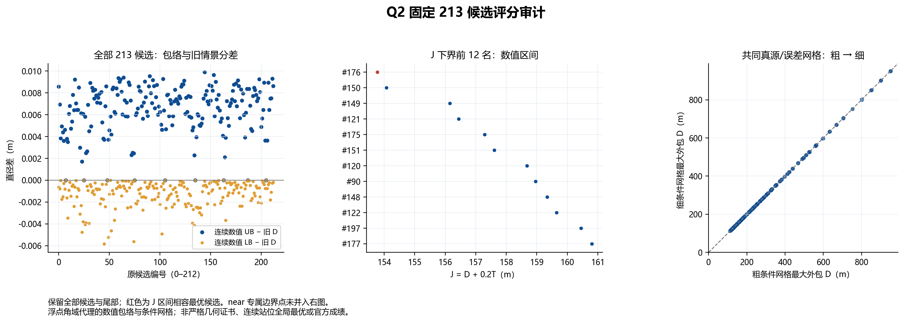

# Q2 固定 213 候选：评分与 near 情景审计

文件及算术门禁通过；收敛候选 213/213。求解器运行 0、模拟器运行 0、官方接口调用 0。

原候选、外包多边形及输入文件的冻结副本已按 SHA256 核对。主实验重算 834518 次后验几何；本报告仅重读既有证据，无新增站位或额外后验求解。

本次是否额外核对 PLAN 所记本机原文件：True。默认只核冻结副本，解压复核不依赖旧绝对路径；`--check-live-sources` 才追加本机原文件核对。

主目标是第二次观测外包域直径 D，同时报告固定 `λ=0.2` 的 `J=D+0.2T`。T 是第二次移动与检测增量秒数。连续变量是报告角度，站位仍是固定离散集合。

**子情景直径算法存在差异：104 个候选的某个旧情景中，旋转卡尺与全点对距离之差超过1e−6 m；最大为 0.691778882 m。213个已保存的15情景最大值仍全部复现通过。文件/算术门禁通过不表示所有子情景几何计算一致；本报告保留差异，未修正共享几何。**

## 仅 D

最小数值上界来自候选 #176：112.926484319 m。

相容最优集合（L≤min U）：[176]。

该候选 U 是否严格小于所有其他候选 L：True；分离裕量 0.287129793 m。

## 固定 λ=0.2 的 J

最小数值上界来自候选 #176：153.784231370 m。

相容最优集合（L≤min U）：[176]。

该候选 U 是否严格小于所有其他候选 L：True；分离裕量 0.287129793 m。

## J 下界最小的 12 个候选

| 编号 | x | y | 旧 D | D 下界 | D 上界 | gap | T 秒 | J 下界 | J 上界 | R@采样D最大处 |
| --- | --- | --- | --- | --- | --- | --- | --- | --- | --- | --- |
| 176 | 476.121593 | 875.333210 | 112.919706 | 112.918997 | 112.926484 | 0.007487 | 204.288735 | 153.776744 | 153.784231 | 56.459499 |
| 150 | 996.121593 | -25.333210 | 113.213808 | 113.213614 | 113.221119 | 0.007505 | 204.288735 | 154.071361 | 154.078866 | 56.606807 |
| 149 | 412.820323 | 884.974226 | 116.086735 | 116.086445 | 116.095449 | 0.009004 | 200.304890 | 156.147423 | 156.156427 | 58.043223 |
| 121 | 972.820323 | -84.974226 | 116.374682 | 116.374243 | 116.383268 | 0.009025 | 200.304890 | 156.435221 | 156.444246 | 58.187122 |
| 175 | 496.121593 | 840.692194 | 117.244083 | 117.243614 | 117.252952 | 0.009338 | 200.233194 | 157.290252 | 157.299591 | 58.621807 |
| 151 | 976.121593 | 9.307806 | 117.559205 | 117.558207 | 117.567838 | 0.009631 | 200.233194 | 157.604846 | 157.614477 | 58.779104 |
| 120 | 349.519053 | 894.615242 | 119.254648 | 119.254559 | 119.262168 | 0.007609 | 197.093727 | 158.673305 | 158.680914 | 59.627280 |
| 90 | 949.519053 | -144.615242 | 119.537173 | 119.536832 | 119.546727 | 0.009895 | 197.093727 | 158.955577 | 158.965472 | 59.768416 |
| 148 | 432.820323 | 850.333210 | 120.168329 | 120.167140 | 120.175290 | 0.008151 | 195.829767 | 159.333093 | 159.341244 | 60.083570 |
| 122 | 952.820323 | -50.333210 | 120.475208 | 120.475040 | 120.483990 | 0.008950 | 195.829767 | 159.640994 | 159.649944 | 60.237520 |
| 197 | 579.422863 | 796.410162 | 120.049416 | 120.047393 | 120.056921 | 0.009528 | 201.977156 | 160.442824 | 160.452352 | 60.023696 |
| 177 | 979.422863 | 103.589838 | 120.401878 | 120.401459 | 120.411020 | 0.009561 | 201.977156 | 160.796890 | 160.806451 | 60.200729 |

## 共同条件网格与 near 专属点

共同粗网格：每候选 153 个真源位置×5 个误差；细网格：561×9，合计 1238382 个情景。细网格嵌套粗网格，固定源位置均以首测30°可实现为条件；不是独立随机样本或真实模拟器成绩。

共同网格 near 情景：粗 20、细 117。同一源位置在不同误差枚举中重复计作情景，不能据此估计 near 概率。

near 边界专属点另有 225 个情景，其中 near 145；未混入共同粗细网格最大值。全部已保存情景的外包直径均不超过 max(角域上界, near上界)+1e−6 m。

细减粗最大值：0.681606253 m；旧15情景到连续角域上界的最大差：0.009901787 m。全部 213 行见 CANDIDATES.csv。

原15情景的 J 最优候选为 #176；这里只按同一固定候选与模型作排名比较，不能将首测轴镜像点之间的原评分差全部归因于采样误差，因为已冻结外包多边形本身并不镜像对称。

细条件网格最大外包 D 最小的候选为 #176。

D 的旧评分与数值 UB 排序：原前5名 [176, 150, 149, 121, 175]，UB前5名 [176, 150, 149, 121, 175]；完整213名有 6 个排名位置不同。这只是数值上界排序变化，未逐对确认分离区间，不能称真实次序翻转。

J 的旧评分与数值 UB 排序：原前5名 [176, 150, 149, 121, 175]，UB前5名 [176, 150, 149, 121, 175]；完整213名有 6 个排名位置不同。这只是数值上界排序变化，未逐对确认分离区间，不能称真实次序翻转。

## 数值与结论边界

每个角区间用扩宽 wedge 得到固定外包模型的数值上界；已核对叶区间无缝覆盖[0,360]、总上界等于叶上界最大值、父子数值残差及各记录的收敛状态。下界来自已采样报告角度，指向这个角域代理目标；不声称每个角度都对应合法的真实 direction 情景。

最大裁剪残差 8.547e-12 m，最大父子上界残差 1.251e-12 m。计算量分开计：缓存内实际 wedge 计算 830897 次，加上旧15情景重算和最终后验后 wedge 共 834305 次，near 圆盘求交 213 次，总后验几何计算 834518 次。这些不是模拟器运行次数。

0.01 m gap 是浮点算法停止阈值，不是严格 FP64/精确算术证书。上面的“严格小于”只是保存浮点数之间的比较，不能升级为精确几何最优证明、连续站位全局最优或官方性能保证。

R 仅为“连续扫描过程中采样到的最大 D 所对应后验”的 MEC 半径；它不是最大 R，也没有优化 R。near 使用独立支路，上界不超过10 m；模型外包和合法情景网格的最大值须分别解释。

本报告只读原始实验并产生新报告目录，未重新裁剪几何或运行候选评分。实验前 7 项独立测试已另行通过；其输出由实验负责人保存，本报告没有重跑测试。原始输入与报告文件各自的 SHA256 见 EVIDENCE_MANIFEST.json 和 ARTIFACT_MANIFEST.json。

