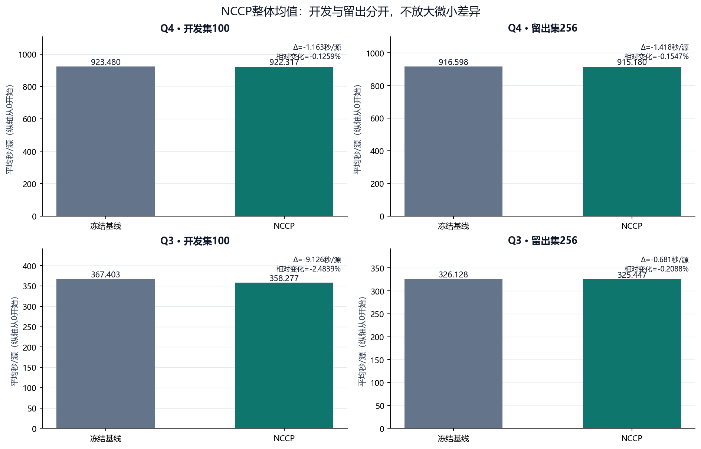
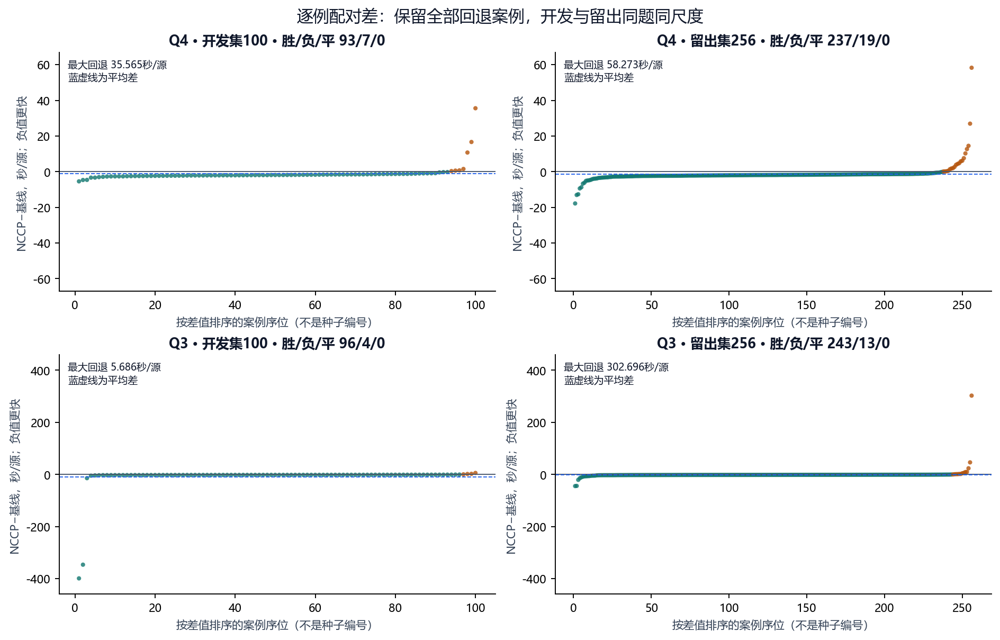
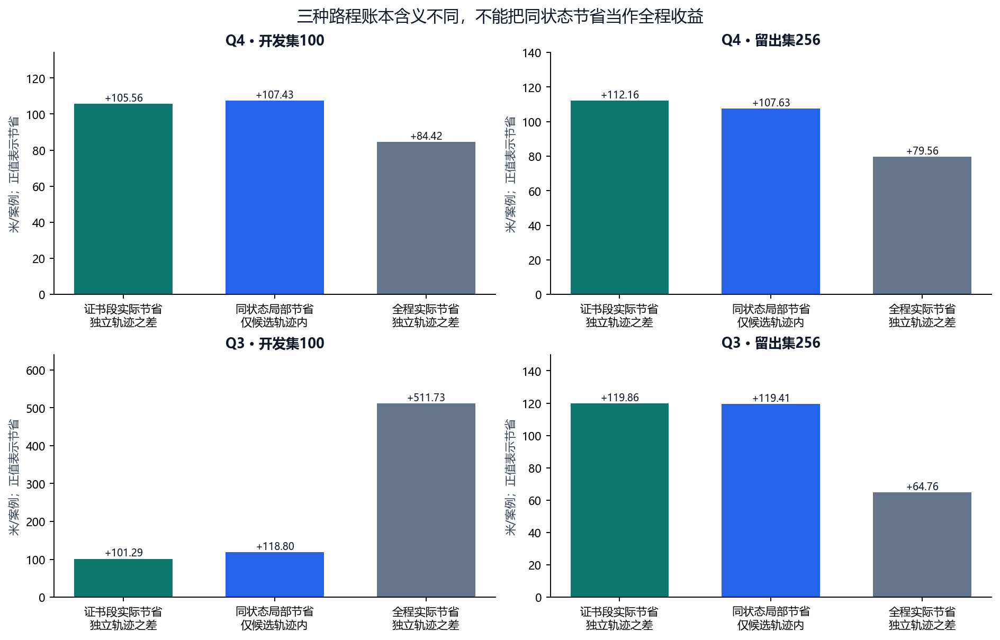

# NCCP配对复核：Q4为主，Q3作为对照

**Q4留出256例中，两方案均全部清除。平均耗时由916.598变为915.180秒/源，NCCP−基线为-1.418秒/源；逐例胜/负/平为237/19/0，最大回退58.273秒/源。**

两批`performance_conclusion_allowed=true`后才生成本报告。开发集100例用于回归检查，留出集256例是在候选结果出现前固定的新种子；两者分开呈现，不混算成绩。相同种子的方案运行不是独立样本，本地确定性种子也不作iid抽样推断。没有官方正式测试成绩。

原始证据位于`J:\2026B_experiments\nccp_20260911`，冻结源码提交为`eb24b8c607878ddfacf0f7798807d92409bd3534`。本报告只读取已有结果，不执行求解器，也不改写acceptance或NCCP_AUDIT。

## 1. Q4结果

| 队列 | 方案 | 全清除/计划 | 成功率 | 均值秒/源 | P50 | P95 | P99 | 最大 |
| --- | --- | --- | --- | --- | --- | --- | --- | --- |
| 开发集100 | 冻结基线 | 100/100 | 100.0000% | 923.480 | 914.858 | 1174.021 | 1246.691 | 1274.039 |
| 开发集100 | NCCP | 100/100 | 100.0000% | 922.317 | 913.341 | 1171.483 | 1245.207 | 1272.358 |
| 留出集256 | 冻结基线 | 256/256 | 100.0000% | 916.598 | 893.272 | 1193.700 | 1222.974 | 1261.407 |
| 留出集256 | NCCP | 256/256 | 100.0000% | 915.180 | 891.624 | 1191.246 | 1221.324 | 1258.053 |

| 队列 | 方案 | 异常 | 协议失败 | 超时 | 其余未清完 | 总虚拟时间/s | 总移动/m |
| --- | --- | --- | --- | --- | --- | --- | --- |
| 开发集100 | 冻结基线 | 0 | 0 | 0 | 0 | 1154271.198 | 4188340.990 |
| 开发集100 | NCCP | 0 | 0 | 0 | 0 | 1152870.772 | 4179898.862 |
| 留出集256 | 冻结基线 | 0 | 0 | 0 | 0 | 2932395.327 | 10635081.632 |
| 留出集256 | NCCP | 0 | 0 | 0 | 0 | 2927783.777 | 10614713.884 |

| 队列 | 配对n | 平均Δ秒/源 | 均值相对变化 | 胜/负/平 | 最大回退秒/源 |
| --- | --- | --- | --- | --- | --- |
| 开发集100 | 100 | -1.163 | -0.1259% | 93/7/0 | 35.565 |
| 留出集256 | 256 | -1.418 | -0.1547% | 237/19/0 | 58.273 |

Δ=NCCP−基线，负值表示更快。均值是各案例T/N的等权平均，P50为中位数，分位数采用线性插值；成功率以计划案例数为分母。异常、协议失败、超时为分类器的互斥案例状态，协议失败同时包括证据格式校验失败后的重分类；总虚拟时间和总路程保留全部已观察案例。这些是已完成案例的描述性比较，不是全程不劣证明。

Q4 开发集100共有7个回退案例，以下最多列5个：

| 本批seed | 旧519索引 | 基线秒/源 | NCCP秒/源 | Δ秒/源 |
| --- | --- | --- | --- | --- |
| 61 | 312 | 855.655 | 891.220 | +35.565 |
| 0 | 0 | 755.336 | 771.986 | +16.649 |
| 76 | 390 | 712.526 | 723.261 | +10.735 |
| 22 | 90 | 1161.729 | 1163.253 | +1.524 |
| 16 | 54 | 1144.449 | 1145.175 | +0.726 |

Q4 留出集256共有19个回退案例，以下最多列5个：

| 本批seed | 旧519索引 | 基线秒/源 | NCCP秒/源 | Δ秒/源 |
| --- | --- | --- | --- | --- |
| 210 | 新留出 | 914.466 | 972.739 | +58.273 |
| 147 | 新留出 | 953.471 | 980.392 | +26.922 |
| 134 | 新留出 | 711.186 | 725.681 | +14.495 |
| 36 | 新留出 | 741.185 | 753.847 | +12.662 |
| 21 | 新留出 | 851.331 | 861.560 | +10.229 |

## 2. Q3对照

| 队列 | 方案 | 全清除/计划 | 成功率 | 均值秒/源 | P50 | P95 | P99 | 最大 |
| --- | --- | --- | --- | --- | --- | --- | --- | --- |
| 开发集100 | 冻结基线 | 100/100 | 100.0000% | 367.403 | 323.910 | 496.574 | 1747.710 | 1791.946 |
| 开发集100 | NCCP | 100/100 | 100.0000% | 358.277 | 322.383 | 422.530 | 1404.530 | 1790.571 |
| 留出集256 | 冻结基线 | 256/256 | 100.0000% | 326.128 | 318.149 | 399.952 | 505.225 | 1051.421 |
| 留出集256 | NCCP | 256/256 | 100.0000% | 325.447 | 316.270 | 405.651 | 537.584 | 1006.757 |

| 队列 | 方案 | 异常 | 协议失败 | 超时 | 其余未清完 | 总虚拟时间/s | 总移动/m |
| --- | --- | --- | --- | --- | --- | --- | --- |
| 开发集100 | 冻结基线 | 0 | 0 | 0 | 0 | 468602.401 | 1960672.004 |
| 开发集100 | NCCP | 0 | 0 | 0 | 0 | 457931.716 | 1909498.578 |
| 留出集256 | 冻结基线 | 0 | 0 | 0 | 0 | 1052911.426 | 4337697.130 |
| 留出集256 | NCCP | 0 | 0 | 0 | 0 | 1049812.747 | 4321118.737 |

| 队列 | 配对n | 平均Δ秒/源 | 均值相对变化 | 胜/负/平 | 最大回退秒/源 |
| --- | --- | --- | --- | --- | --- |
| 开发集100 | 100 | -9.126 | -2.4839% | 96/4/0 | 5.686 |
| 留出集256 | 256 | -0.681 | -0.2088% | 243/13/0 | 302.696 |

Δ=NCCP−基线，负值表示更快。均值是各案例T/N的等权平均，P50为中位数，分位数采用线性插值；成功率以计划案例数为分母。异常、协议失败、超时为分类器的互斥案例状态，协议失败同时包括证据格式校验失败后的重分类；总虚拟时间和总路程保留全部已观察案例。这些是已完成案例的描述性比较，不是全程不劣证明。

Q3 开发集100共有4个回退案例，以下最多列5个：

| 本批seed | 旧519索引 | 基线秒/源 | NCCP秒/源 | Δ秒/源 |
| --- | --- | --- | --- | --- |
| 64 | 330 | 267.821 | 273.507 | +5.686 |
| 52 | 264 | 326.472 | 328.774 | +2.302 |
| 79 | 408 | 257.429 | 259.157 | +1.728 |
| 33 | 150 | 489.815 | 490.158 | +0.343 |

Q3 留出集256共有13个回退案例，以下最多列5个：

| 本批seed | 旧519索引 | 基线秒/源 | NCCP秒/源 | Δ秒/源 |
| --- | --- | --- | --- | --- |
| 7 | 新留出 | 329.194 | 631.890 | +302.696 |
| 201 | 新留出 | 334.872 | 381.182 | +46.311 |
| 53 | 新留出 | 381.509 | 405.091 | +23.581 |
| 221 | 新留出 | 479.459 | 489.131 | +9.672 |
| 219 | 新留出 | 402.726 | 411.845 | +9.119 |

## 3. 清除段路程：实际轨迹与同状态局部比较分开

**实际证书段差**：两个独立方案各自运行时，多边形证书clear动作的移动距离总和之差。**同状态局部节省**：只在NCCP自己的每个清除状态中，比较它实际落点与MEC圆心的距离后求和。两个量的状态集合不一定相同，不能互相替代，也不能直接换算成全程时间改善。

| 题目 | 队列 | 基线证书段总米数 | NCCP证书段总米数 | 实际证书段Δ米 | 候选同状态局部节省米 | 全程实际Δ米 |
| --- | --- | --- | --- | --- | --- | --- |
| Q4 | 开发集100 | 221092.670 | 210536.598 | -10556.071 | 10743.397 | -8442.128 |
| Q4 | 留出集256 | 574140.233 | 545426.760 | -28713.473 | 27553.521 | -20367.748 |
| Q3 | 开发集100 | 200965.516 | 190836.468 | -10129.048 | 11879.836 | -51173.426 |
| Q3 | 留出集256 | 532140.310 | 501457.210 | -30683.100 | 30570.236 | -16578.393 |

| 题目 | 队列 | 基线证书段平均米/源 | NCCP证书段平均米/源 | NCCP单事件局部节省最小米数 |
| --- | --- | --- | --- | --- |
| Q4 | 开发集100 | 168.822 | 160.524 | 0.080647470 |
| Q4 | 留出集256 | 173.068 | 164.454 | 0.010932410 |
| Q3 | 开发集100 | 156.554 | 148.966 | 0.057740725 |
| Q3 | 留出集256 | 161.434 | 152.018 | 0.033826434 |

## 4. 原地clear：near与NCCP多边形证书不是同一类

near计数指测量返回near后在原坐标clear；多边形零移动计数指已满足多边形证书条件时，选定清除点恰为当前位置。二者分开统计，不把near事件当作NCCP新增能力。选点回退表示NCCP选择器返回MEC圆心，不等于Q4进入光学兜底。

| 题目 | 队列 | 方案 | 多边形证书clear | near原地clear | 多边形证书零移动 | 选点回退MEC次数 |
| --- | --- | --- | --- | --- | --- | --- |
| Q4 | 开发集100 | 冻结基线 | 1262 | 13 | 0 | 0 |
| Q4 | 开发集100 | NCCP | 1262 | 13 | 30 | 0 |
| Q4 | 留出集256 | 冻结基线 | 3256 | 23 | 0 | 0 |
| Q4 | 留出集256 | NCCP | 3255 | 21 | 78 | 0 |
| Q3 | 开发集100 | 冻结基线 | 1244 | 16 | 0 | 0 |
| Q3 | 开发集100 | NCCP | 1244 | 17 | 26 | 0 |
| Q3 | 留出集256 | 冻结基线 | 3222 | 38 | 0 | 0 |
| Q3 | 留出集256 | NCCP | 3220 | 39 | 92 | 0 |

| 题目 | 队列 | 方案 | 当前位置已有证书的案例 | 对应事件数 | 有零移动clear的案例 | 全部零移动clear次数 |
| --- | --- | --- | --- | --- | --- | --- |
| Q4 | 开发集100 | 冻结基线 | 29 | 30 | 13 | 13 |
| Q4 | 开发集100 | NCCP | 29 | 30 | 40 | 43 |
| Q4 | 留出集256 | 冻结基线 | 65 | 78 | 23 | 23 |
| Q4 | 留出集256 | NCCP | 66 | 78 | 82 | 99 |
| Q3 | 开发集100 | 冻结基线 | 22 | 26 | 16 | 16 |
| Q3 | 开发集100 | NCCP | 22 | 26 | 36 | 43 |
| Q3 | 留出集256 | 冻结基线 | 76 | 91 | 33 | 38 |
| Q3 | 留出集256 | NCCP | 79 | 92 | 97 | 131 |

当前位置已有证书由每个多边形clear事件的起点逐顶点严格复算，不要求方案实际选择留在原地；near不计入此状态数。案例计数每例至多一次，事件计数可超过案例数；全部零移动clear次数为near与多边形证书零移动之和。

## 5. 三张小图

均值柱图纵轴从0开始，避免把小幅收益画成大幅跃升；配对图保留正负两侧，并展示所有案例。路程图将总量除以本批案例数，单位为米/案例，三种节省的定义与上表相同。

PNG适合直接查看；同名SVG可编辑和放大。

## 6. 审计门禁和解释边界

- 两个cohort均通过现有NCCP证据审计；本呈现脚本还核对manifest指纹、配置/种子映射、配对CSV、均值/分位数及路程账本。
- 开发集200条历史基线已逐动作精确复现，差异为0。新留出集没有历史轨迹，此项明确不适用；其前置条件是开发审计通过。
- 顶点安全距离及同状态移动不增加由原NCCP_AUDIT逐事件复核；这不推出整条执行路径更短或每例耗时更低。
- 查看结果后调参会改变留出解释。如果看过结果后修改算法或参数，需明确新实验，不能把反复使用本留出集称作独立验证。
- runtime和设备启动耗时不作为得分或加速结论。没有重新设计模型，没有使用官方正式测试。

本汇总不授予本地研发ACCEPT。performance_conclusion_allowed只是本批性能证据可比较，shadow开关动作轨迹一致性、完整离线测试、invalid安全恢复等完整验收事项须另行核对；不得从本报告门禁反推它们已全部完成。

数学口径补充：精确MEC中心位于可行多边形的凸包内，任意覆盖该多边形的合法清除点距该中心不超过19.999 m。因此同一当前状态下，单次多边形clear直接节省的移动时间最多为19.999/5=3.9998秒。这是单次动作的理论界，整局均值变化超过4秒/源可以来自后续路径或调度改变，并不与该局部界矛盾。本呈现脚本不新增数值验收门槛，也不把代码返回的带浮点裕量MEC半径代入更强的界替代原证书审计。

## 7. 给GPT的证据文件

本目录`evidence/`保存两份manifest、两份NCCP审计、两份配对CSV、原REPORT和每题acceptance/summary/阶段汇总/原始CSV等小证据。完整逐动作trace仍保留在J盘，不复制到本目录。`EVIDENCE_MANIFEST.json`逐项记录J盘绝对来源、复制后相对路径、大小及SHA-256；`ARTIFACT_MANIFEST.json`记录本次生成文件的校验值。

原审计报告：[开发集REPORT](evidence/development100/REPORT.md)、[留出集REPORT](evidence/holdout256/REPORT.md)。
完整配对表：[开发集CSV](evidence/development100/NCCP_PAIRS.csv)、[留出集CSV](evidence/holdout256/NCCP_PAIRS.csv)。

[开发案例说明](evidence/DEVELOPMENT_CASE_NOTES.md)仅解释开发集中的已观察案例，不是留出集病例，也不把开发阶段的回退解释外推成留出结论。
