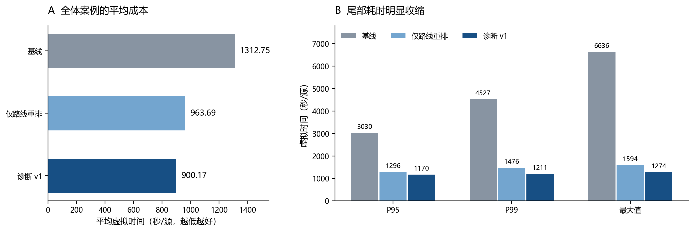
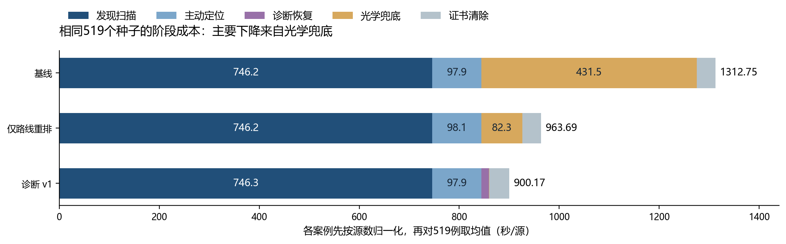

# B题 Q4效果对比｜晨检入口

**已完成。本轮整理已有实验，未重新运行求解器。** 求解代码冻结于 `3c4e844`，完整证据已提交于 `a3d94ff`。双击 [index.html](index.html) 看图表并筛选519个种子；给GPT审阅可直接发送本文与 [CASE_NOTES.md](CASE_NOTES.md)。

**当前结论：保留诊断v1作为下一步Q4开发参照。** 在同一批519个种子上，v1平均耗时比基线低 **31.43%**，比仅路线重排低 **6.59%**。基线的大部分尾部已被压下；下一步优先审计发现扫描的调度成本。默认入口仍保留基线，运行v1需显式使用 `configs/q4_p4_diag_v1_grid_v1.yaml`。

## 一眼看结果

单位均为**虚拟秒/源**，每个案例总虚拟时间除以该场景总源数，再对519个案例求均值或分位数；不是程序执行秒数，也不是按全部源数加权的均值。三方案使用同一场景和同一 `grid_v1`。P95表示95%的本组案例不超过该值。

|方案|全清除案例|均值|中位数|P95|P99|最大|
|---|---:|---:|---:|---:|---:|---:|
|基线|519/519|1312.75|1002.81|3030.04|4526.54|6636.04|
|仅路线重排|519/519|963.69|935.96|1295.80|1475.51|1594.16|
|诊断 v1|519/519|900.17|878.91|1169.99|1211.35|1274.04|

- v1相对基线：均值 −31.43%，P95 −61.39%，P99 −73.24%，最大值 −80.80%。同种子逐例比较为 **264胜、26负、229平**。
- v1相对仅路线：均值 −6.59%，P95 −9.71%，P99 −17.90%，最大值 −20.08%。同种子逐例比较为 **273胜、17负、229平**。
- 基线 → 仅路线平均省349.06秒/源；仅路线 → v1再省63.52秒/源。不能把总计412.58秒/源全部归给诊断。以上为配置对比的描述性结果，未做因果分离或iid显著性推断。
- 三方案都已全清除，因此当前收益体现为耗时、路程和清除尝试下降，不能写成成功率提升。

## 成本为什么下降，下一步做什么

|指标（519例汇总）|基线|仅路线|v1|
|---|---:|---:|---:|
|平均路程 km|67.34|44.05|41.81|
|发生光学兜底的案例|290/519|290/519|31/519|
|光学兜底轮次|574|570|33|
|光学清除尝试|61,753|69,513|260|
|全部清除尝试|67,957|75,721|7,005|
|诊断测量|0|0|1,000|

仅路线虽然省路程和时间，光学清除尝试却增加；不能将其描述为减少探测次数。路线变化也会改变后续观测及定位区域，不能假设三方案始终搜索完全相同的点集。

下表先对每个案例按源数归一化，再取519例均值。Δ=v1减参照，负数表示省时；五阶段Δ相加等于总体均值Δ。

|阶段（秒/源）|基线|仅路线|v1|Δ基线|Δ仅路线|
|---|---:|---:|---:|---:|---:|
|发现扫描|746.20|746.15|746.26|+0.06|+0.11|
|主动定位|97.93|98.09|97.90|-0.04|-0.19|
|诊断恢复|0.00|0.00|15.25|+15.25|+15.25|
|光学兜底|431.49|82.30|0.47|-431.02|-81.83|
|证书清除|37.12|37.15|40.29|+3.17|+3.14|

按**阶段原始秒数之和 / 总原始秒数之和**计算，v1的发现扫描占全体耗时82.54%，其自身最慢5%（26例）中占85.27%；这26例没有光学兜底。全体光学兜底仅占0.06%。这个占比口径与上表均值的比例不同，不能混算。

下一步建议审计45个覆盖节点上的位置—频道访问顺序、重复无信号测量和末个源的首次发现时刻，保持覆盖结构和MEC≤19.999m证书。占比大不代表能消除全部成本；新调度方案尚未实现或验证。暂不继续扩大诊断深度。

## 回退和最慢案例必须保留

|seed索引|基线|仅路线|v1|Δ基线|Δ仅路线|
|---|---:|---:|---:|---:|---:|
|455|1147.99|1152.49|1158.88|+10.89|+6.38|
|370|1150.12|1152.92|1158.53|+8.41|+5.61|
|101|934.93|942.50|942.85|+7.92|+0.35|
|123|968.81|1044.99|976.45|+7.64|-68.54|
|125|865.13|871.46|871.25|+6.12|-0.21|

- **366，最大收益**：基线6636.04 → 仅路线1391.50 → v1 977.91秒/源，主要省去昂贵光学搜索。
- **455，最大对基线回退**：v1多10.89秒/源（0.95%）。基线光学很快命中，诊断和随后的证书清除成本未完全赚回。
- **105，最大对仅路线回退**：v1多13.65秒/源（1.56%）。路线改变后续发现观测，不能仅用“诊断是否有效”解释。
- **283，v1最慢**：1274.04秒/源；发现扫描占83.27%，仍遍历45个发现节点，重点看末个源的发现时刻。

四例的三方案JSON、gzip轨迹及场景原件保存在 [case_evidence](case_evidence/)；逐动作解释见 [CASE_NOTES.md](CASE_NOTES.md)。所有519例（含完整32字节种子）可在网页筛选或下载 [paired_519.csv](paired_519.csv)。seed为本次冻结清单索引，不是官方测试编号。

## 网格版本与CUDA对照

旧网格只复跑同一清单前100个种子；不能与519例总体直接相减。下面只比较同100例均值。

|方案|grid_v0|grid_v1|新减旧（秒/源）|
|---|---:|---:|---:|
|基线|1372.50|1420.43|+47.93|
|仅路线重排|969.71|980.31|+10.60|
|诊断 v1|907.51|907.50|-0.01|

在旧网格的100例内，v1相对旧基线仍省 **33.88%**；收益并非只由新网格产生。不过新网格的保守边界增加了基线成本，所以必须保留版本对照。`grid_v1`解决数值稳定性，并非速度优化。

同一清单前20个种子×3方案的60次CUDA运行，与对应CPU运行的虚拟时间、距离及5项关键计数逐项完全相等。此处只验证决策结果一致性，未评估GPU速度，更未验证8卡部署。

## 实验范围与证据入口

- 主Q4是519个不同种子×3方案=1557次；另有旧网格300次、CUDA60次，**Q4合计1917次运行**。连同Q3的519次，共2436次。追加对照复用种子，不增加独立样本数。
- 使用用户提供的还原演练生成器及独立本地规则引擎；不是官方正式场景、不是历史518种子清单的完整复跑。结构压力种子不是iid样本，519/519只说明这份清单全部通过，不能外推所有场景必胜。
- Q4验收1557/1557齐全，无失败、超时、异常或协议错误；失败不会因提前退出变成时间胜利。`accept`只表示完整性和完成率，不能作为性能最优证明。
- **未启动官方App，正式测试累计启动0次。** 本报告未新增测试运行；求解策略保持冻结。
- 可携带原始输入：[source](source/)；输入原路径及SHA256：[provenance.json](provenance.json)；全体实验的轨迹账本审计：[EVIDENCE_AUDIT.json](source/EVIDENCE_AUDIT.json)。
- 完整2436次证据包：`2026B_还原演练引擎_2436次评测_3c4e844.zip`，SHA256 `54352627feb44eef820ad613cbcb98a7fb08baece9cab57afa742203084faa65`。本晨检包保留重点案例的完整轨迹，其余全量轨迹在该证据包。

重建本晨检材料：在仓库执行 `python B_solver/reporting/q4_review.py`（依赖NumPy、Matplotlib）。图表PNG适合直接发送，SVG可编辑；网页不依赖网络或外部库。
