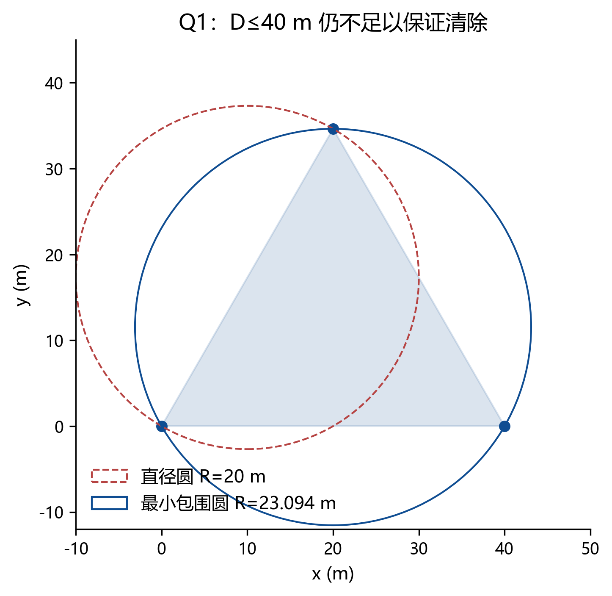
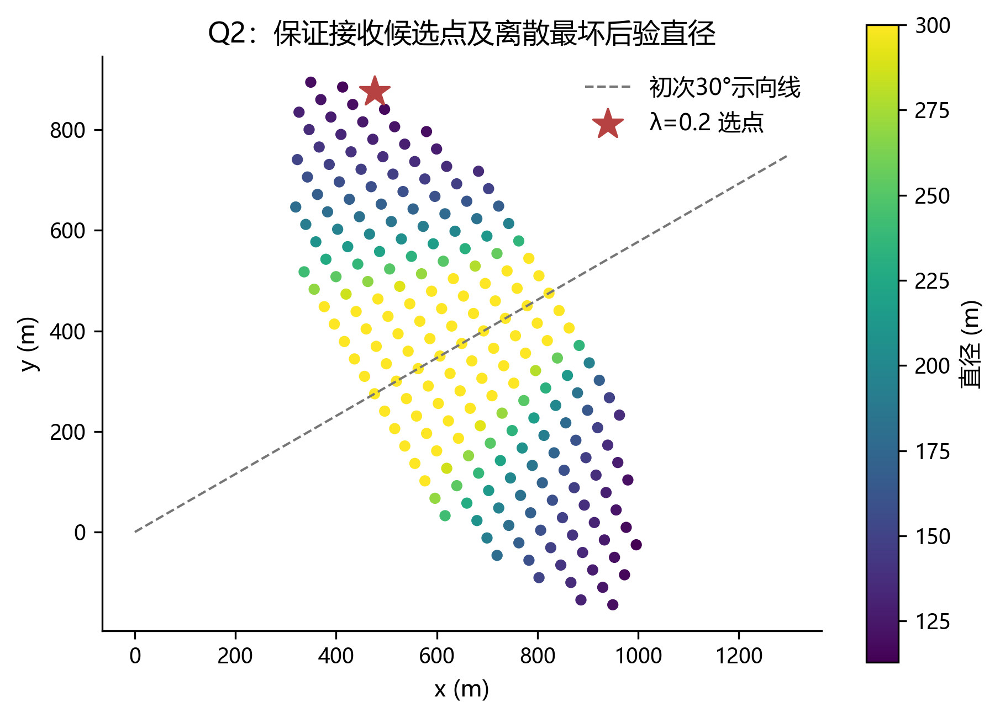
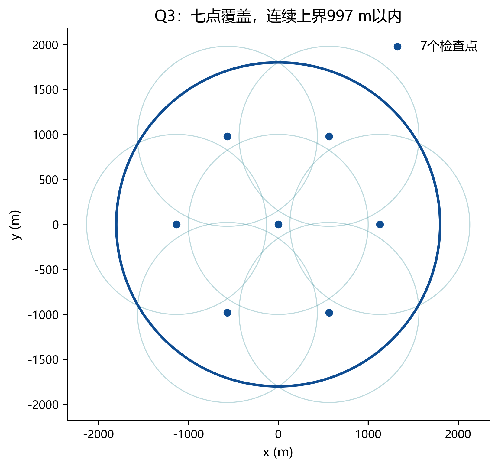
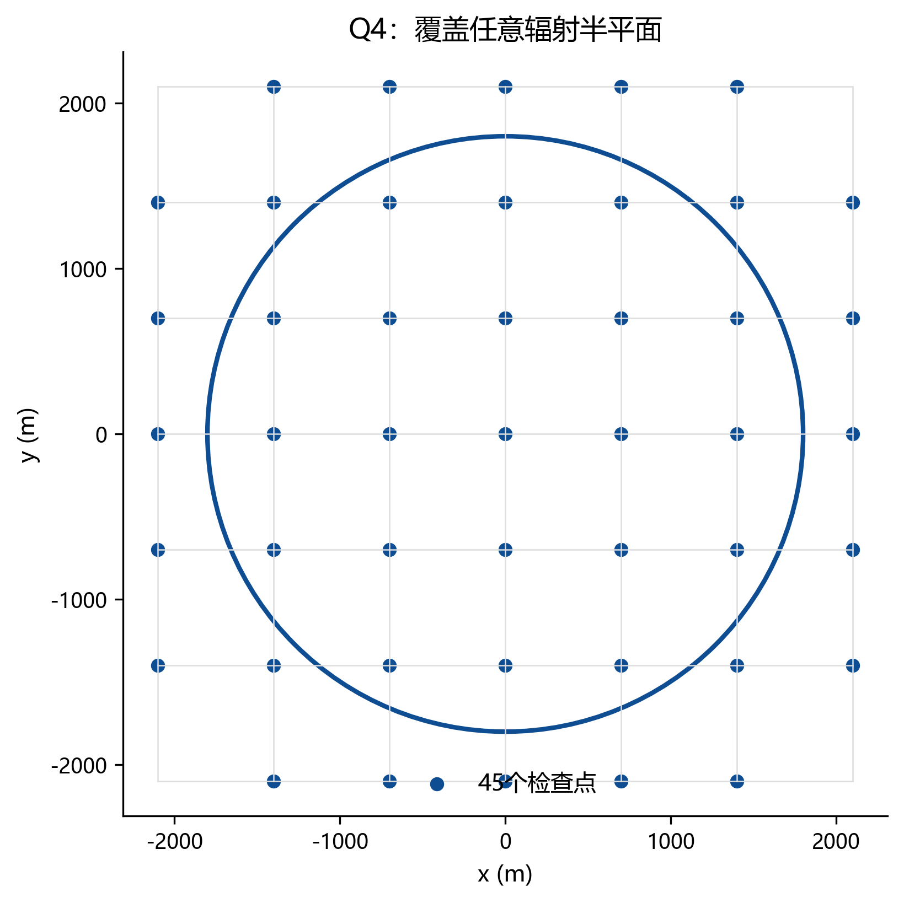
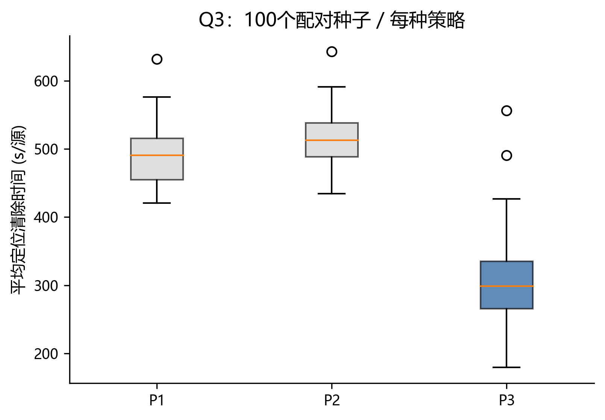
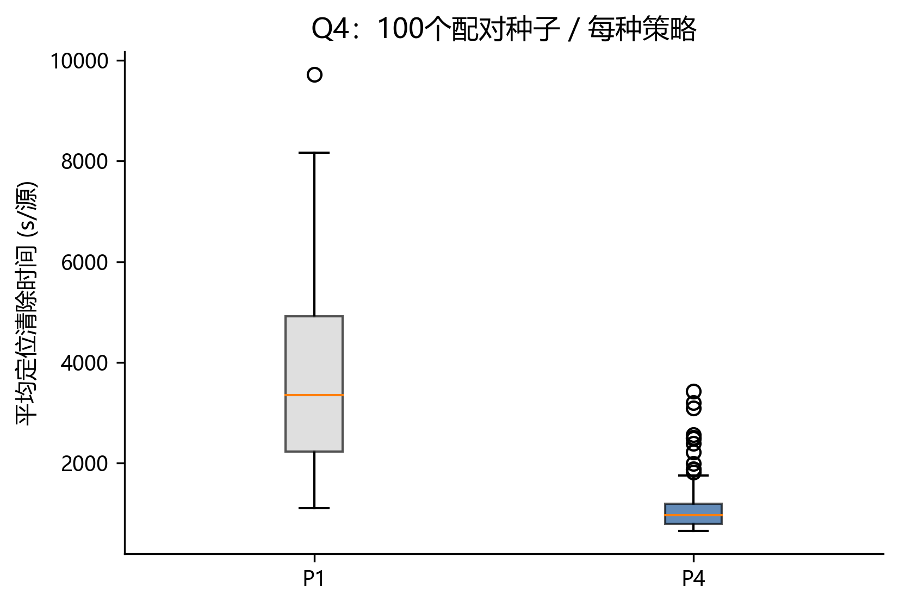
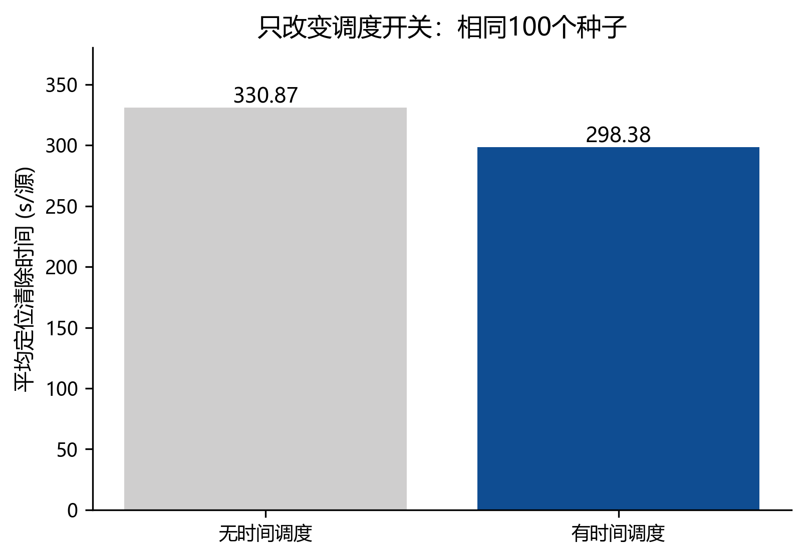

# 覆盖保证的有界不确定性主动搜索定位

## 解题报告说明

本文针对2026年B题，给出问题1至4的数学模型、可执行算法、离线对照结果及官方演练记录。正式测试依用户要求没有执行，文中的演练结果不能填入题目要求的正式测试表。报告是当前可复现的求解交付稿，不以未运行的正式案例或未提供的服务器硬件作为证据。

## 摘要

无线电干扰源数量未知，且同一地点的测向误差固定，单纯增加原地检测次数不能保证定位精度。本文把每次示向度转化为包含真实位置的角域，以半平面交集维护位置外包集，用最小包围圆判定是否能够在20米距离内保证清除。针对全向源，构造中心加六个环点的搜索骨架，并给出连续圆域的覆盖半径上界；针对未知定向源，利用目标位于方格单元角点凸包内这一性质，建立任意辐射半平面下的发现保证。主动观测同时考虑位置不确定性、接收可能性和虚拟移动时间，在线调度决定继续探索或处理已发现目标。混合源假设显式包含全向类型，有限粒子只用于动作选择，不能替代几何清除证书。

当前版本在100个配对种子、六个策略配置构成的600个本地完整案例中均清除全部源。Q3主策略的案例平均定位清除时间为298.38秒/源，Q4主策略为1155.51秒/源。单独打开时间调度开关使Q3平均时间下降9.82%；Q4利用无信号约束使平均时间下降8.81%。官方演练采用单列日志和UI源数核验。100万粒子、128个候选的分块计算在本机CUDA上实测0.529秒，CPU为6.614秒。上述性能属于已列明的场景和硬件，离散观测选择与路径调度不具有全局最优性证明。

关键词：有界误差；集合定位；覆盖搜索；主动观测；定向干扰源

## 一、问题重述与分析

目标位于半径1800米的圆域中，每个目标独占一个频道，机器狗只能逐个频道检测。题目包含三个不同层面的判断：未知频道是否可能有源、已有信号能把源的位置约束到多小的区域、当前移动能否减少总任务时间。把这些判断混成单一的点估计，会遗漏不可接收方向上的目标，也会在交会几何较差时过早清除。

问题1需要计算交会多边形的直径并判断直径圆的覆盖性质。问题2在只有一次方位观测时选择第二测点，不能使用尚未知晓的真实目标位置。问题3要求在全向源条件下保证没有遗漏，并用模拟器统计实际代价。问题4增加未知辐射方向，圆域边界向外辐射的目标可能在整个区域内部都接收不到，因此允许机器狗离开目标圆域是有效搜索所必需的条件，而非越界错误。

## 二、假设、参数与信息边界

保留题目的源静止、频道唯一、传播无相互干扰和直线移动条件。误差仅采用有界假设，不引入高斯似然、虚构的信号强度或同地点重复测量独立性。算法只能读到自己的历史请求与响应；自建环境的真实源表只供生成案例、验证包含关系和计算结果分母，在线Solver不读取该表。

题目理想误差为±1°。附件规定示向度保留两位小数，接口处理采用±1.005°加浮点余量，防止量化把真实位置推到约束外。有效接收半径未知且位于1000至1500米。正常direction事件既提供角域，也提供1500米距离上界；保留凸外包时允许不利用5米近距排除和全向无信号排除圆，其代价是保守而不是失去真实位置。

位置、角度和时间的单位分别为米、度、秒。虚拟耗时不同于程序运行耗时：检测5秒只增加模拟器虚拟时间，不要求程序休眠5秒。成功clear共5秒，失败clear为3秒，且clear不切换测向机频道。附录协议示例被独立复算为199秒。

## 三、问题1：交会区域与直径

令u(θ)为方向单位向量、s_i为检测位置、θ_i为示向度。用有向叉积避免斜率在竖直方向发散，也避免跨越0°时角度区间的特殊处理。两条线性不等式限定一个朝前的窄角域，其交集给出有界误差下的可行位置集合。

$$ u(\theta)=(\cos\theta,\sin\theta) $$

$$ \Omega_n=\bigcap_{i=1}^{n} W_i $$

W_i同时满足cross(u(θ_i−δ),p−s_i)≥0和cross(u(θ_i+δ),p−s_i)≤0。若不引入圆域，先用四个坐标方向的线性规划区分空、无界和有界情形。有界时以精确坐标极值构造外框，再逐半平面裁剪。无界交集的直径不能输出为任意人为大框的对角线；输入仅一个方位角时，纯交会模型就会返回无界。

文献[4]的第III节采用有界方位误差、楔形交集及最坏直径/面积准则，可作为这一建模框架的相关依据。其研究对象是方形环境中的静态布点和传感器数量优化；不能将其三角网格近似比直接转化为本题移动耗时或清除效率的保证。旋转卡壳、MEC清除条件及在线频道调度需分别论证。

已知目标圆域时，以外切正多边形覆盖圆，再裁剪。外切近似的最大径向误差是r(sec(π/m)−1)，因此真实圆弧区域始终被保留。区域直径和最小包围圆对输出多边形计算，对原圆弧区域则为上界。直接把圆离散成内接多边形会破坏包含真实位置的证明，不能用于保证清除。

凸多边形上任意内点都是顶点的凸组合，固定另一点时距离最大值可在顶点取得，所以最远点对属于顶点对。旋转卡壳沿凸边界维护对踵点，直径计算为O(v)；半平面裁剪的代价另计，不能把整条求解流程的复杂度笼统说成O(v)。300组随机凸多边形用全部点对核对直径，并枚举二点/三点支撑圆独立核对MEC；4000次有界误差观测更新均保留构造的真实点。

$$ D(\Omega)=\max_{p,q\in\Omega}\|p-q\| $$

取边长40米的正三角形，三条有界误差测向约束可产生这个区域。构造的测点距全部三角形顶点都小于1500米，因而不是违反接收距离的抽象反例。其直径为40米，最小包围圆半径为40/√3≈23.094米，大于20米。任何以D为直径的圆都不能覆盖该区域；仅使用D≤40作为清除条件会出现没有保证的尝试。

图1将同一个可行区域的两种圆放在统一坐标系中。红色虚线圆由一个最长点对决定，另一顶点仍在圆外；蓝色圆通过三个支撑点，才覆盖所有可能位置。该反例说明“已定位到直径40米范围”并不等于“存在距离全部可能位置20米的清除点”。这一差异不是测量次数、统计置信度或实现精度造成的，而是平面凸几何本身的性质。

$$ \frac{D}{2}\le R_{MEC}\le\frac{D}{\sqrt{3}} $$

严格停止条件采用外包集的R_MEC≤19.999米，机器狗到圆心执行clear。半径用全部顶点的最大距离再核算，并留数值余量。若只想用直径得到充分条件，可改成D≤20√3，而不能用40。一般情况下使用MEC能避免这个保守替代条件造成的额外观测。

## 四、问题2：候选区域与第二测点

一次检测产生长而窄的可行集。在初始示向线上前后移动，可能仍形成近乎平行的约束；侧向移动产生交会角，使纵向不确定性下降。但由于目标距离未知，不能直接把机器狗放在“真实目标的垂线上”。算法从当前多边形几何中心和长轴生成候选，用后验集合与实际移动代价评分。

为了给出可操作的候选区域，定义C_safe为所有多边形顶点的1000米圆盘交集。任意候选点若到全部顶点都不超过1000米，则到多边形内每个位置都不超过1000米，因此在全向条件下保证接收。这是充分区域；第一次测点虽然已知能接收，却不一定满足这个更保守的充分条件，并不矛盾。

$$ C_{safe}=\bigcap_{v\in V(\Omega_1)}B(v,1000) $$

对每个候选s，代表性目标位置及误差端点产生多个可能的新示向度，再以相同半平面方法计算后验直径。评分是采样后的最坏直径加移动、检测耗时，λ具有米/秒的单位。若候选不保证接收，把no_signal作为保守的无收缩分支；任何期望值或粒子概率都是明示的设计权重，而不是题目给定的真实概率规律。

$$ J(s)=\max_z D(\Omega_2(s,z))+\lambda\left(\frac{\|s-s_0\|}{5}+5\right) $$

数值演示固定初次测点(0,0)、示向度30°，并非题目缺失的实测数据。离散候选区域含213个保证接收点。下表体现移动时间与几何精度的权衡，所列“最坏”限定在已枚举观测中，不能称为连续观测空间的严格最优。

受文献[4]最坏情形准则启发，在线决策应在当前信息条件下对全部可行下一观测z取上确界；等价地，应同时枚举当前可行真实位置x与新测量误差ε，再由z=arg(x−s)+ε生成观测。第一次测量已经获得，其影响保留在当前集合中，不能重新选择第一示向度。仅在暂定目标点上改变ε会漏掉位置不确定性。当前代码采用有限采样近似，不把采样最大值称为严格保证的最坏上界。Q4还需把无信号分支及全向/定向类型纳入结果集合；文献[4]不提供这些可接收条件。

|λ (m/s)|测点x|测点y|采样最坏直径(m)|动作时间(s)|
|---|---|---|---|---|
|0.0|476.12|875.33|112.92|204.29|
|0.2|476.12|875.33|112.92|204.29|
|1.0|326.22|834.97|130.45|184.29|
|5.0|336.31|517.49|241.87|128.43|

图2中的散点既满足接收半径约束，又是在具体搜索网格中枚举的候选位置。靠近初次示向线的候选通常不能有效收缩最坏纵向误差，向侧方偏移后直径下降。星标点是λ=0.2时当前离散搜索的选择。图中颜色不是目标存在概率，而是条件可行集的直径；把这两者混为一谈会给后续调度引入未经支持的概率假设。

100个单源对照中，随机安全测点、基于暂定中点的垂向测点、NBV的平均后验直径分别为136.62、76.21、72.17米，而前两次检测累计平均虚拟时间分别为162.99、165.30、188.32秒。NBV获得更小的几何不确定性，但要付出更多移动，因此不能仅凭定位直径宣布总任务更快。

## 五、问题3：全向覆盖与在线清除

检查点取原点及半径r=1130米的正六边形顶点。对于任意极角，最近环点的角差不超过30°。中心和最坏角环点等距发生在径向距离r/√3处；内侧由中心覆盖，外侧利用到环点距离平方关于径向变量的凸性，只需比较区间端点。

$$ R_{cover}=\max\left(\frac{r}{\sqrt{3}},\sqrt{1800^2+r^2-1800\sqrt{3}r}\right) $$

代入得到连续覆盖上界996.949676米，小于最小接收半径1000米。作为补充，100万随机位置及0.01°间隔圆边界验证均无覆盖空洞。证明依赖连续不等式，随机点本身不能保证没有极小空洞。七点是一组简洁可行设计，本文没有证明它是任意布局下的最少点数或最短路线。

图3以1000米接收圆展示七个检查点的作用。环点半径取1130米是为了减少访问路程，并且仍留有约3米的理论接收余量。若取900√3米，最大覆盖距离可降到900米，但机器狗必须走更长的环路；本题目标是虚拟总时间，覆盖裕量并非越大越好。这里把保证发现的几何要求与路线优化的目标分开处理，使二者的取舍能够明确检查。

每个检查点扫描所有未清除频道，UNKNOWN不会因为一次无信号被删除。只要全部检查点访问完毕，所有实际存在的全向源至少出现一次可接收观测。只有这些已发现源也全部清除，才能完成退出证明；清除10个并不足以结束，因为真实数量可能为16个。

每次扫描或定位更新后，算法比较最近覆盖任务的代价与已检测目标的估计处理代价。当前位置到MEC圆心的移动、检测、换频及预期定位动作都参与评分。可保证清除的目标优先处理；其余目标可以暂存而继续探索。覆盖点开放路线用近邻和2-opt整理，不要求最后返回原点。

当测向交集不能及时收缩时，算法对当前外包多边形的旋转包围矩形建立20米网格。每个位置到最近网格点不超过10√2米，因此逐点光学检测具有确定性覆盖保证。该备用过程可能耗时较长，但不会把定位困难的源丢弃。对于near响应，距离已不超过5米，可直接clear，无需再构造示向度。

## 六、问题4：任意未知方向的覆盖与假设更新

全向的七点覆盖不能推出定向源发现保证。一个位于圆边界且指向外侧的源，对所有位于其内侧的检测点都可能无信号。题目允许机器狗出圆域，故采用700米方格并保留距原点不超过2800米的必要格点，当前共45点。

任意源p属于某网格单元，四个角点v_i到p的距离均不超过700√2≈989.949米。因为p是四个角点的凸组合，对任意发射方向单位向量n，若全部n·(v_i−p)<0，则其同一凸组合也严格小于0，和n·(p−p)=0矛盾。因覆盖半平面含边界，所以至少一个角点位于有效辐射半平面内，且位于最小接收距离内。

$$ p=\sum_i\alpha_i v_i,\quad \alpha_i\ge0,\quad\sum_i\alpha_i=1 $$

$$ \max_i n\cdot(v_i-p)\ge0,\qquad\|v_i-p\|\le700\sqrt{2}<1000 $$

图4中的外侧检查点用于捕获边界源向外辐射的情况，不能因为它们不在目标分布圆内而删除。能够删除的是距圆心超过1800+1000米的格点，因为它们不可能是证明中距某个源989.949米以内的必要角点。这一覆盖方式用更多探测和移动代价换取方向未知条件下的确定性发现；减少检查点必须重新证明半平面覆盖，而不能只检查普通圆盘覆盖。

位置集合仍由signal角域和距离上界作保守外包。额外维护z=(x,y,φ,R,type)假设，type区分全向和定向。若把全部源强行当作半平面辐射源，会错误排除真实全向源。对于无信号，只排除在当前位置本应可接收的假设；对于有信号，还要求方位误差在界内；near同时要求距离不超过5米。新提议粒子必须重放该频道全部历史，包括首次检测到信号之前的无信号记录。

候选点评价结合signal/no_signal分裂收益及预期方位几何收缩，再除以移动和检测耗时。由于不同假设的权重是人为设计而非已知真实先验，粒子筛选和信息收益只决定先去哪里。无论粒子数量多少，它们都不能证明连续真实集合已被覆盖，也不能据粒子MEC触发有保证的清除。粒子退化时保留原空间外包集，最终仍由MEC或光学网格完成清除。

## 七、完整案例与消融结果

每个配置使用相同100个种子，随机分布、圆周向外、固定端点偏差、近距离聚簇四类情形各25个。源数按10至16生成，频道无重复。位置误差通过坐标与频道的确定性映射生成，重复测量误差不变。这是明确的自建压力测试设计，不是对官方随机分布的逆向推断。六配置共600次完整执行，但只有100组配对输入，不能按600个独立样本解释统计显著性。

|问题/策略|无信号约束|案例数|全清除案例|均值(s/源)|P95(s/源)|
|---|---|---|---|---|---|
|Q3 P1|利用|100|100|489.70|551.84|
|Q3 P2|利用|100|100|514.75|576.44|
|Q3 P3|利用|100|100|298.38|391.58|
|Q4 P1|利用|100|100|3787.20|7564.30|
|Q4 P4|利用|100|100|1155.51|2498.48|
|Q4 P4|忽略|100|100|1267.09|2754.53|

图5显示P2的NBV立即追踪并没有胜过更简单的P1。这不是应删除的异常结果：一次定位更精确可能需要更远的侧向移动，而刚发现源就追踪到底还会打断整体覆盖路线。P3把定位与探索放在同一事件调度中比较，平均时间明显降低。由于P2与P3还包含扫描和重规划方式差异，该对比只支持整体策略改进，不能把全部差值归因于单一调度公式。

图6展示定向场景下的耗时尾部。所有配置都用方格覆盖和光学兜底，故本批次均清除全部源；直接追踪基线在方向不利或首次可行集过长时产生大量无效移动和光学探查。P4将接受概率、集合几何和时间结合后降低代价，但P95仍高于均值，说明方向性与边界布局对路线有显著影响。保持全清除率与压低极端耗时应同时评价。

为隔离调度影响，额外在相同P3观测、相同路径模块下，只关闭探索/定位竞争开关，完成100对、共200次案例。无调度平均330.87秒/源，有调度298.38秒/源，下降9.82%。Q4无信号消融在其余设置一致时由1267.09降至1155.51秒/源，下降8.81%；这说明无信号有可利用信息，但未证明该降幅适用于任意分布。

图7比图5更接近单因素实验：只改变是否允许已发现目标与下一覆盖任务竞争，观测函数、MEC停止条件、路径整理及种子均保持一致。它支持时间调度本身有收益，同时也说明主表中P1/P2与P3之间更大的差距包含多个工程决策。区分整体对比与单因素消融，能够避免对某一个公式贡献的夸大解释。

覆盖消融中，Q3只在中心扫描发现比例为26.29%，七点和方格均为100%；Q4中心扫描为16.13%，七点为59.97%，方格为100%。这里混入50个边界压力案例，发现比例不代表官方案例概率。结论应表述为七点方法存在定向遗漏风险、方格构造在规定条件下有几何保证。

点估计消融在仅有两次测量时，用示向线交点直接尝试clear，三种测点策略的成功率为71%、75%、75%。集合方法仅在MEC条件成立时宣告有保证，因此准备清除的案例数更少。随机两测点案例未显示D≤40与MEC条件的不同触发次数，不能伪称实验已观察到这种差异；其不充分性由问题1的合法三角形反例明确证明。

## 八、官方演练结果与计时审计

以下全部来自模拟器“演练测试”，不属于正式测试。每个案例的总源数由演练结束界面确认，成功清除数由JSON响应累加，逐条复算移动、换频、测向和清除时间。最大累计复算偏差在数微秒量级，与接口小数舍入一致。程序时间列采用/enter与/exit响应中的现实时间戳差；客户端墙钟时间另存在CSV中。

|问题|演练案例编码|清除/总数|平均时间(s/源)|程序时间(s)|
|---|---|---|---|---|
|Q3|PQQ4-MB6F-SAA3-DW4G|11/11|355.32|1.579|
|Q3|FN4X-3M4R-5J34-37TQ|16/16|323.80|2.002|
|Q4|HN9E-WSW4-6XAM-SBVP|14/14|807.44|6.812|
|Q4|FA5S-RYDX-J9NA-3GAF|10/10|1131.93|7.765|
|Q3|68PJ-A6UH-2Q8B-BMT2|12/12|342.86|1.487|
|Q4|NVR3-565D-QRRT-M7E9|10/10|4955.39|12.111|

首个Q3演练使用v1，其余记录按清单注明v2。演练样本有限，只能证明这些具体场景的协议闭环和清除结果，不能以此宣布对官方分布有统计保证。完整请求与响应、复算指标和UI核实源数都在results/official_practice中，加密日志由模拟器保存。正式测试的三次结果以及正式加密日志均为未执行状态，本文没有制作虚假案例编码。

Q4案例NVR3-565D-QRRT-M7E9清除10/10，但触发两次光学网格兜底，累计移动约224公里、清除尝试420次，平均时间4955.39秒/源。该结果显著差于前两例，表明当前保守兜底可能主导总耗时；全清除不等于效率稳定。后续优化应首先减少兜底前的定位失败及兜底路径代价，并保留同等的清除保证。

## 九、CUDA实算及多卡执行

GPU处理候选点与假设粒子之间的距离、朝向和接收判别，CPU处理凸多边形与最终清除证书。双分块大小为65536粒子、16候选，避免把100万×128×多个中间张量一次性展开。混合类型位参与可接收判定，不使用BF16或FP8。

本机NVIDIA GeForce RTX 4060 Laptop GPU、Torch 2.7.1+cu118完成100万粒子、128候选实算。CPU 6.6137秒，CUDA 0.5285秒，本次计数任务的比值为12.51倍；最大已分配显存约23.81 MiB。FP32与CPU FP64在单个候选的信号计数最大相差1个粒子，这属于阈值附近的数值差异，不能用于硬性证书。因此保留FP64几何，不把GPU启发式得分等同于数学证明。

multi_gpu.py已在本机单GPU以独立worker方式完成16个完整合成案例。8卡服务器的入口采用每卡独立进程分配种子，避免同一案例的复杂通信。尚未连接4090/V100服务器，当前只能声明算法使用兼容的FP32操作路径，不能声明目标硬件已经部署或测得相同加速比。官方模拟器只监听本机回环接口，服务器代码仅承担合成实验。

## 十、模型评价与复现边界

补充相关工作时，应按建模、动作选择和多目标规划三条线组织，而非把四篇论文写成同一有界误差理论的线性演进。文献[5]提供移动测点选择的应用背景；文献[4]支撑有界误差集合表示。文献[6]联合考虑移动和测量耗时，但使用高斯状态估计、EKF与歧义风险参数，其β-Cautious策略不等于本报告的直径缩减/耗时比。不能把更换为多边形和MEC后的策略称为继承了该论文的常数因子保证。

文献[7]采用贝叶斯直方图和强化学习进行多目标路径规划，并假设每步得到各目标可正确关联的观测；本题逐频道测量且源可能不可接收，必须另行计入换频及无信号分支。本文借鉴其多目标联合规划的问题视角，未实现或验证该论文的学习策略。覆盖、MEC和负观测本身是已有数学或估计工具，本文贡献应限定为针对题目参数的构造、证明与组合实现，不宣称这些概念为首次提出。

基于上述文献可提出后续候选策略：沿当前可行多边形最长方向的垂向生成测点，结合接收约束筛选，作为现有NBV的额外候选；对Q4在启动网格兜底前比较短测点序列的代价。此项属于待实现、待同种子验证的改进，不纳入当前实算成绩，也不以文献支持替代实验。当前源码与结果仍对应报告已列出的版本。

该方案把发现保证和效率优化分开：覆盖证明回答是否遗漏，几何外包回答何时能保证清除，启发式调度回答优先采取哪个动作。外包近似、忽略部分负观测几何以及光学网格都会提高保守性和耗时，但不会主动删除真实源位置。保留这些不同角色，能够在优化失效时继续执行确定性搜索。

不足主要在Q4的覆盖节点较多和部分定位触发网格兜底。有限粒子不是连续集合的完整表示，候选观测只离散采样，路径2-opt也可能陷入局部最优。因此本文给出可行策略和实算证据，不声称理论最短时间。后续若压缩方格节点、改变终止条件或增加学习策略，必须重新检查发现和清除的两条证明，并使用同种子对照，而不是在正式测试上试参。

当前材料包含源代码、源文档文本、逐案例CSV、最坏20例、几何反例、候选区域表、消融数据、SVG/PNG图表及实际HTTP记录。正式测试未运行是用户的明确限制，不构成可用演练记录可以冒充正式结果的理由。代码快照用SHA256记录以便后续比较，快照不等同于已满足正式测试冻结条件。

## 参考来源

[1] 用户提供的2026年高教社杯全国大学生数学建模竞赛B题《无线电干扰源的快速自动定位与清除》及附件1、附件2。所有题目参数、时间定义和HTTP协议以此为准。

[2] Welzl E. Smallest enclosing disks (balls and ellipsoids). New Results and New Trends in Computer Science, LNCS 555, 1991:359–370. DOI:10.1007/BFb0038202。本文采用其随机增量的最小包围圆思路，并对全部顶点复核半径。

[3] Dietrich Gebert. Ponytail skill. https://github.com/dietrichgebert/ponytail 。用作复用、少依赖和保留必要检查的实现原则，不作为数学结论的来源。

[4] Tokekar P, Isler V. Sensor Placement and Selection for Bearing Sensors with Bounded Uncertainty. Proceedings of ICRA, 2013:2515–2520. DOI:10.1109/ICRA.2013.6630920. 作者原文：https://tokekar.com/pubs/tokekar2013asensor.pdf 。

[5] Tokekar P, Vander Hook J, Isler V. Active Target Localization for Bearing Based Robotic Telemetry. IROS, 2011. 作者页面：https://tokekar.com/tokekar2011active.html 。

[6] Vander Hook J, Tokekar P, Isler V. Cautious Greedy Strategy for Bearing-only Active Localization: Analysis and Field Experiments. Journal of Field Robotics, 2014, 31(2):296–318. DOI:10.1002/rob.21499. 作者原文：https://tokekar.com/pubs/vanderhook2014cautious.pdf 。

[7] Engin S, Isler V. Active Localization of Multiple Targets from Noisy Relative Measurements. WAFR 2020项目页面：https://ksengin.github.io/active-target-localization/ 。所核对预印本题名为Active localization of multiple targets using noisy relative measurements，arXiv:2002.09850：https://arxiv.org/html/2002.09850 。
