# 逐图分析意义与读取说明

## 01 绝对成绩与完整尾部

问题：当前官方成绩是否处在本地同一量级？

读法与实测信息：曲线越靠左表示该样本整体较快；尾部保留至最大值，避免只看平均数。

边界：不同场景，不能据此宣称策略改进或模拟器偏差。

数据：data/cases.csv

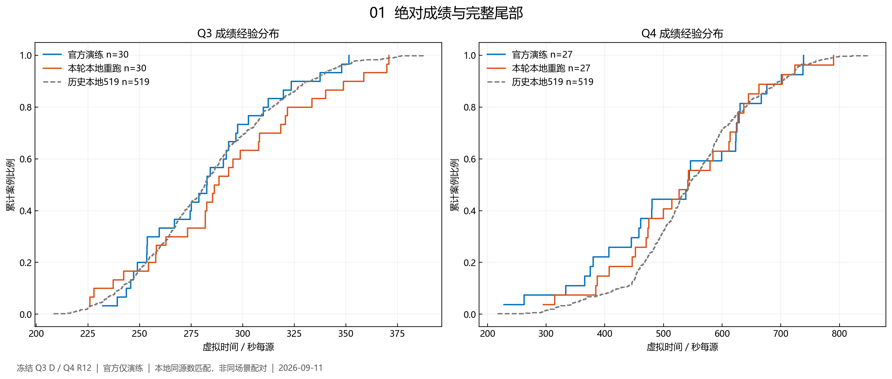

## 02 归一化波动与全部案例

问题：排除量纲后，离散程度有多大？

读法与实测信息：箱线为中位数和四分位；点为每局；方差使用n−1分母。

边界：各组独立除以自身均值，均值被强制为1，不能用此图比较绝对效率。

数据：data/cases.csv

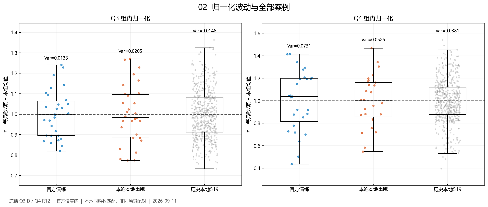

## 03 同样本量的均值参照范围

问题：少量场次的均值能在固定本地库中波动多少？

读法与实测信息：每次按官方N结构从519库无放回抽取同样多案例；展示5000个子集的统计量。

边界：这是固定库的子集分布，不是独立新增跑测，也不是官方总体置信区间。

数据：data/reference_resampling.npz

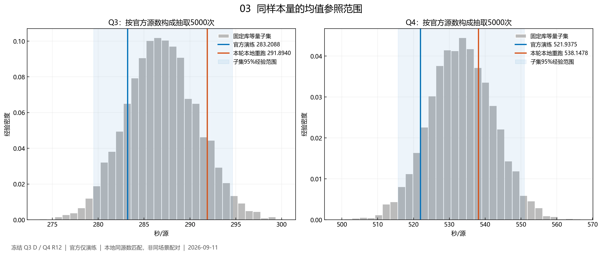

## 04 同样本量的归一化方差参照范围

问题：少量场次的归一化方差能在固定本地库中波动多少？

读法与实测信息：每次按官方N结构从519库无放回抽取同样多案例；展示5000个子集的统计量。

边界：这是固定库的子集分布，不是独立新增跑测，也不是官方总体置信区间。

数据：data/reference_resampling.npz

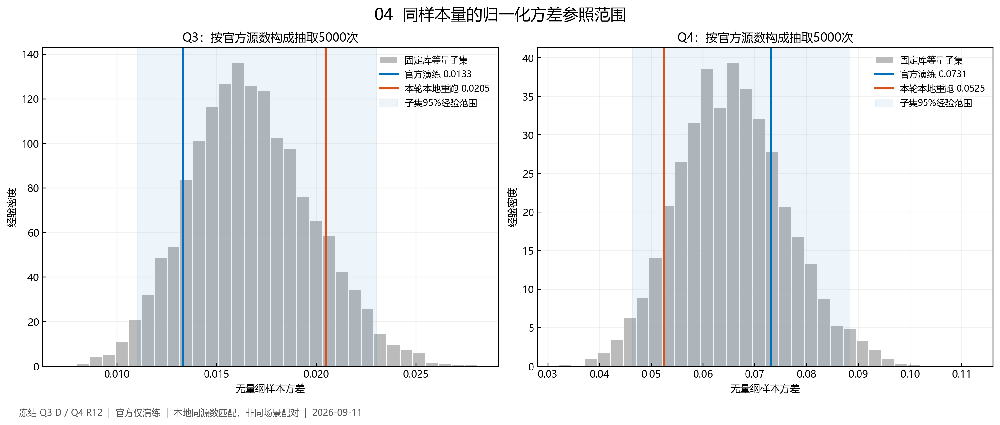

## 05 源数匹配检查

问题：两批小样本的源数构成是否相同？

读法与实测信息：蓝橙柱逐项相等是本轮匹配成立的直接证据；灰柱展示519库原始构成。

边界：只匹配N，不保证坐标、方向比例、接收半径或噪声难度匹配。

数据：data/cases.csv

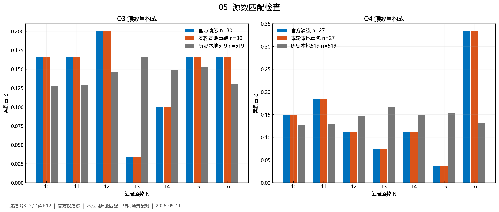

## 06 源数分层的逐局表现

问题：总体差异是否可能来自固定扫描成本的摊薄？

读法与实测信息：同一N内看蓝橙散点和历史库均值；不是把N当作完整难度指标。

边界：部分N仅少量场次；不拟合高阶曲线或做分层显著性断言。

数据：data/cases.csv

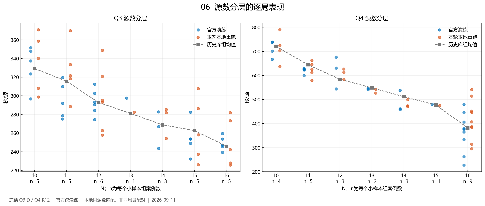

## 07 Q3 样本累计与波动估计

问题：只看早期几场是否容易误判？

读法与实测信息：左图显示单场与累计均值；右图对每个前缀重新计算z和方差，首场不计算。

边界：顺序是接入顺序，不是算法学习过程；曲线变平不等于统计保证。

数据：data/cases.csv

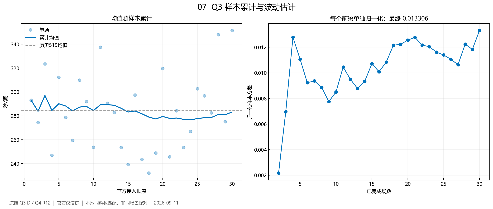

## 08 Q4 样本累计与波动估计

问题：只看早期几场是否容易误判？

读法与实测信息：左图显示单场与累计均值；右图对每个前缀重新计算z和方差，首场不计算。

边界：顺序是接入顺序，不是算法学习过程；曲线变平不等于统计保证。

数据：data/cases.csv

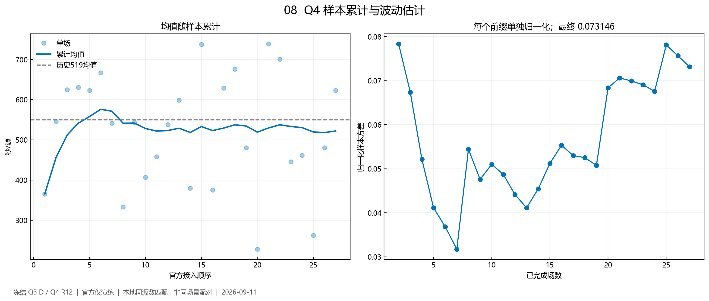

## 09 总时间到底花在哪里

问题：两边时间差主要表现为哪种动作成本？

读法与实测信息：四项严格相加为每局秒/源再取平均；移动按官方虚拟时间差扣除动作成本并用距离/5交叉核验。

边界：这是动作账本，不能把移动全称为发现阶段。

数据：data/cases.csv

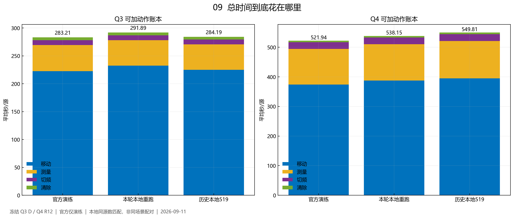

## 10 路径长度与完成时间

问题：哪些可观测成本伴随慢例？

读法与实测信息：每点是一局；灰色为历史库背景，蓝橙为两批同量级样本。

边界：路程与时间存在机械关系；无信号比例不是漏检率，也不能单独证明策略失效。

数据：data/cases.csv

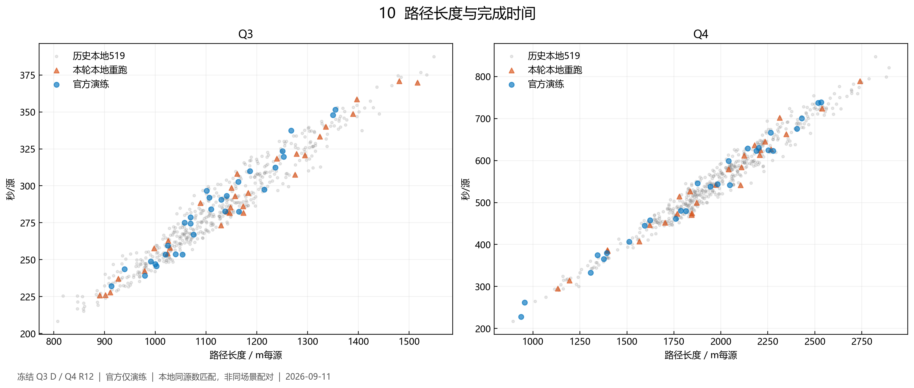

## 11 无信号观测负担

问题：哪些可观测成本伴随慢例？

读法与实测信息：每点是一局；灰色为历史库背景，蓝橙为两批同量级样本。

边界：路程与时间存在机械关系；无信号比例不是漏检率，也不能单独证明策略失效。

数据：data/cases.csv

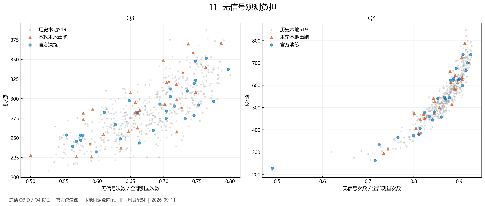

## 12 最后发现、最后清除与退出

问题：瓶颈发生在何种任务里程碑之前或之后？

读法与实测信息：由每个实际成功频道的第一次direction/near与成功clear重建；三段覆盖整个虚拟时间。

边界：第一段可能包含其他源的定位和清除，不能等同算法discovery阶段。

数据：data/cases.csv

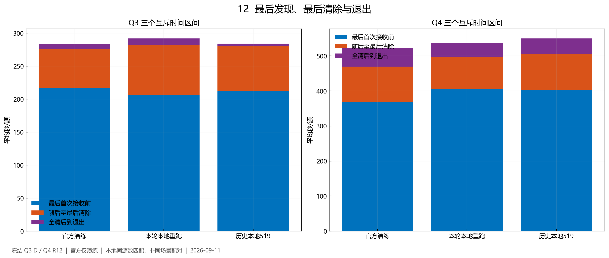

## 13 清除进度形态

问题：慢局是清除推进慢，还是清除后仍有扫描？

读法与实测信息：按各局最终时间归一化，对齐任务进程；曲线提前到1反映退出前已全清。

边界：时间归一化抹去了绝对快慢；阴影为案例IQR，不是置信带。

数据：data/targets.csv

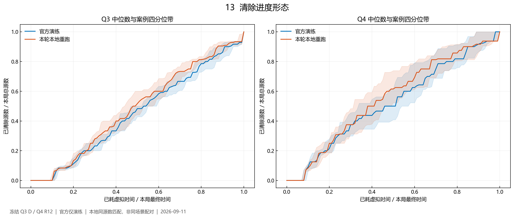

## 14 Q3 圆域测量位置强度

问题：空间上的高负担区域在哪里？

读法与实测信息：两图统一200m网格与色标；虚线是真实任务圆域R=1800m，显示圆外机器人动作。次数强度按每局平均。

边界：颜色表示机器人行为，不能当作干扰源密度。无信号比例只在已访问测点上成立；留白不是零风险。

数据：data/spatial_grids.npz; data/actions.csv

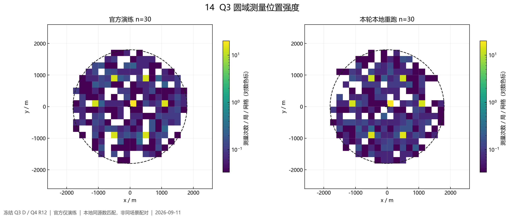

## 15 Q4 圆域测量位置强度

问题：空间上的高负担区域在哪里？

读法与实测信息：两图统一200m网格与色标；虚线是真实任务圆域R=1800m，显示圆外机器人动作。次数强度按每局平均。

边界：颜色表示机器人行为，不能当作干扰源密度。无信号比例只在已访问测点上成立；留白不是零风险。

数据：data/spatial_grids.npz; data/actions.csv

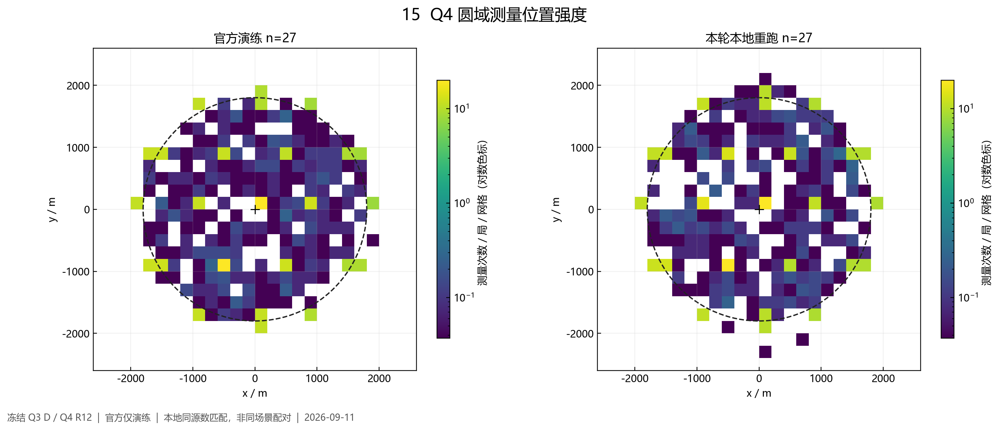

## 16 Q3 圆域格内无信号占比

问题：空间上的高负担区域在哪里？

读法与实测信息：两图统一200m网格与色标；虚线是真实任务圆域R=1800m，显示圆外机器人动作。每格分母是该格全部测量次数；低于5次留白。

边界：颜色表示机器人行为，不能当作干扰源密度。无信号比例只在已访问测点上成立；留白不是零风险。

数据：data/spatial_grids.npz; data/actions.csv

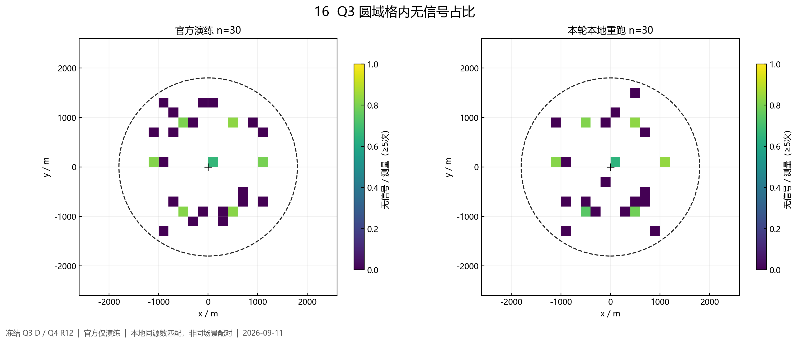

## 17 Q4 圆域格内无信号占比

问题：空间上的高负担区域在哪里？

读法与实测信息：两图统一200m网格与色标；虚线是真实任务圆域R=1800m，显示圆外机器人动作。每格分母是该格全部测量次数；低于5次留白。

边界：颜色表示机器人行为，不能当作干扰源密度。无信号比例只在已访问测点上成立；留白不是零风险。

数据：data/spatial_grids.npz; data/actions.csv

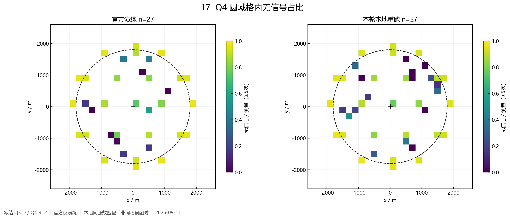

## 18 Q3 圆域移动路径空间负担

问题：空间上的高负担区域在哪里？

读法与实测信息：两图统一200m网格与色标；虚线是真实任务圆域R=1800m，显示圆外机器人动作。路径按不超过50m的分段中点累积，所有网格长度与实际总路程核对相等。

边界：颜色表示机器人行为，不能当作干扰源密度。无信号比例只在已访问测点上成立；留白不是零风险。

数据：data/spatial_grids.npz; data/actions.csv

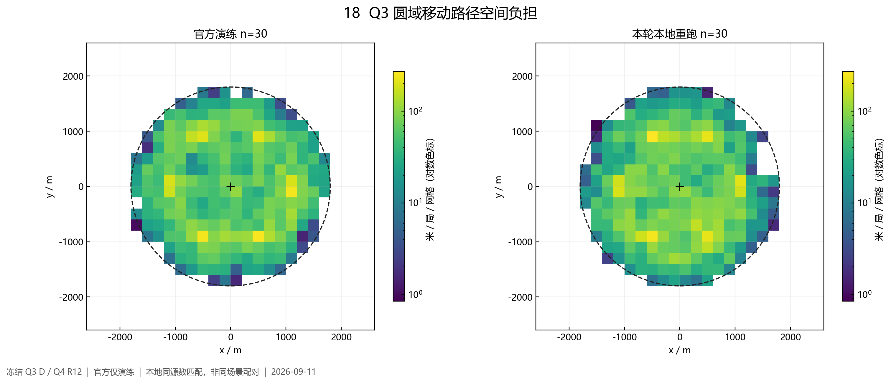

## 19 Q4 圆域移动路径空间负担

问题：空间上的高负担区域在哪里？

读法与实测信息：两图统一200m网格与色标；虚线是真实任务圆域R=1800m，显示圆外机器人动作。路径按不超过50m的分段中点累积，所有网格长度与实际总路程核对相等。

边界：颜色表示机器人行为，不能当作干扰源密度。无信号比例只在已访问测点上成立；留白不是零风险。

数据：data/spatial_grids.npz; data/actions.csv

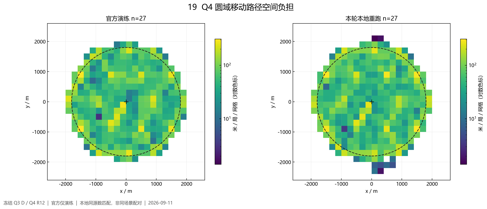

## 20 首次发现发生在哪些测点

问题：哪个位置承担了较晚的首次发现？

读法与实测信息：每个成功清除频道只取第一次direction/near测点；颜色是相对完成时间，点重合说明共同扫描站位。

边界：点是机器人接收位置，不是干扰源坐标；重叠点数量需结合动作CSV。

数据：data/targets.csv

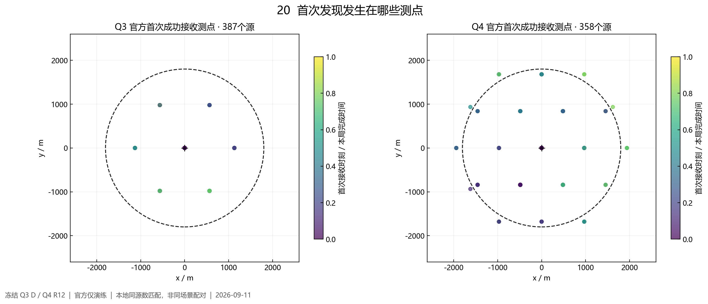

## 21 本地算法阶段账本

问题：本地真正的discovery负担占多少？

读法与实测信息：直接使用求解器记录的互斥stage累计时间，审核所有阶段相加等于整局时间。

边界：官方无线日志没有stage字段，不外推为官方阶段百分比。

数据：data/cases.csv

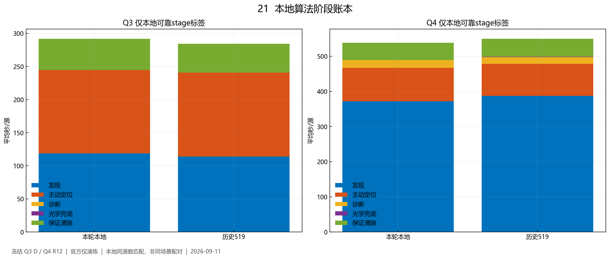

## 22 Q4方向构成是剩余混杂因素

问题：仅匹配源数是否已足够？

读法与实测信息：官方定向数量取结束界面；本地取场景文件。左图比较构成，右图展示个体差异。

边界：类型数量不是在线策略额外输入；本轮没有匹配接收半径、几何布局或定向比例。

数据：data/cases.csv

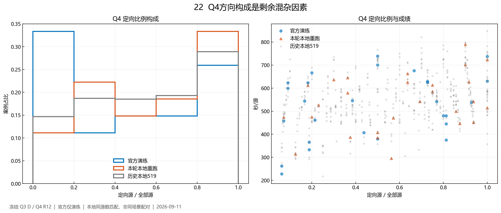

## 23 本轮重跑的确定性复现

问题：本地此次执行是否复现历史同策略？

读法与实测信息：逐seed比较相同冻结源码、场景与CPU后端的总虚拟时间。

边界：零差验证复现，不证明本地引擎与官方在任意场景完全等价。

数据：data/cases.csv

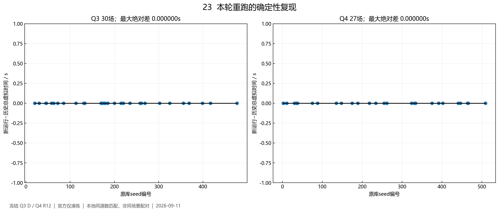

## 24 Q3 官方演练最快案例：YQS2-AS82-W9VY-FWWW

问题：具体路径如何形成该局成绩？

读法与实测信息：该局232.150秒/源，3482.243秒，13.701km；无信号67/112。轨迹颜色随虚拟时间推进；时间线按首次接收排序，长度包含等待调度及后续定位。

边界：最快/中位附近/最慢按本批成绩预定规则选取，非随机代表；直线段只连接指令目标点。官方清除点不是精确源坐标，时间线长度也不是纯定位计算时间。

数据：data/traces.json → q3_official_YQS2-AS82-W9VY-FWWW; data/targets.json

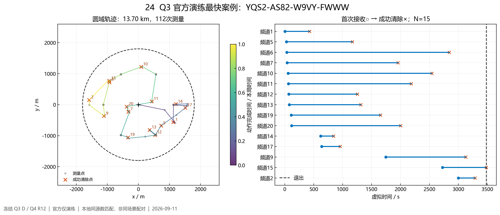

## 25 Q3 官方演练中位附近案例：UEKY-9ZJN-5WY3-RM7G

问题：具体路径如何形成该局成绩？

读法与实测信息：该局282.721秒/源，3958.096秒，15.925km；无信号78/118。轨迹颜色随虚拟时间推进；时间线按首次接收排序，长度包含等待调度及后续定位。

边界：最快/中位附近/最慢按本批成绩预定规则选取，非随机代表；直线段只连接指令目标点。官方清除点不是精确源坐标，时间线长度也不是纯定位计算时间。

数据：data/traces.json → q3_official_UEKY-9ZJN-5WY3-RM7G; data/targets.json

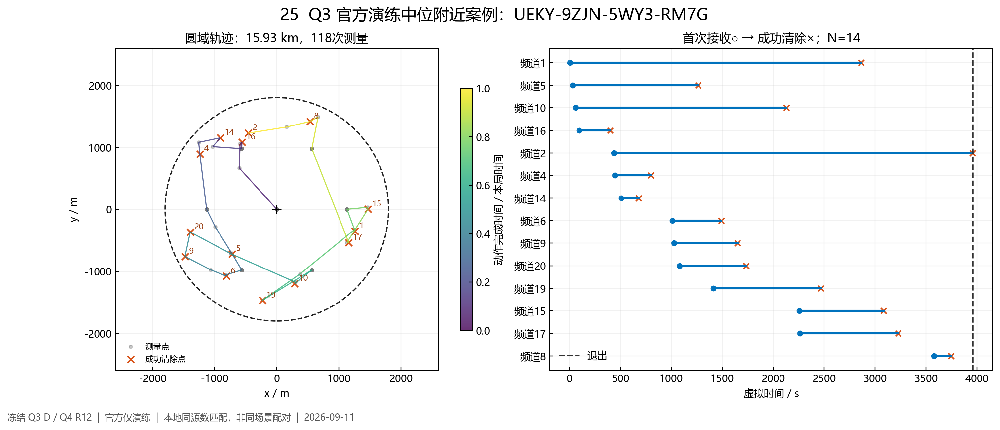

## 26 Q3 官方演练最慢案例：F9C6-6BU8-FCJQ-FWNM

问题：具体路径如何形成该局成绩？

读法与实测信息：该局351.469秒/源，3514.690秒，13.548km；无信号97/127。轨迹颜色随虚拟时间推进；时间线按首次接收排序，长度包含等待调度及后续定位。

边界：最快/中位附近/最慢按本批成绩预定规则选取，非随机代表；直线段只连接指令目标点。官方清除点不是精确源坐标，时间线长度也不是纯定位计算时间。

数据：data/traces.json → q3_official_F9C6-6BU8-FCJQ-FWNM; data/targets.json

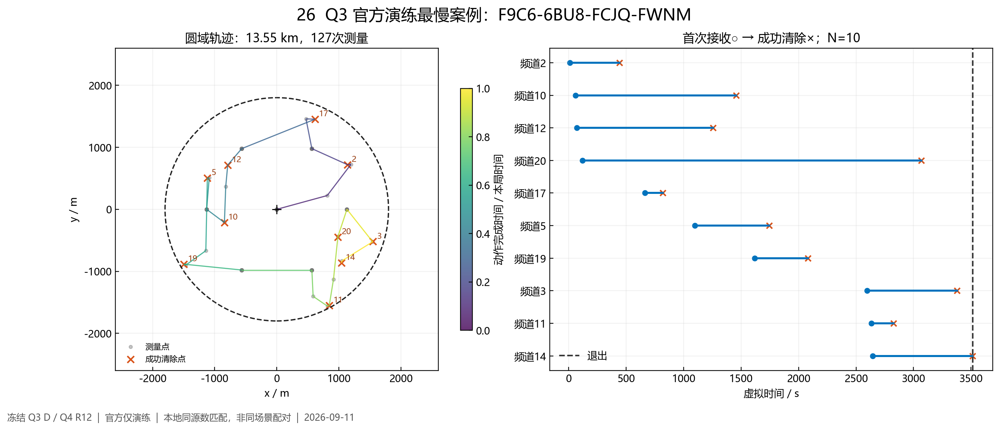

## 27 Q3 本轮本地重跑最快案例：235

问题：具体路径如何形成该局成绩？

读法与实测信息：该局225.769秒/源，3612.306秒，14.247km；无信号68/115。轨迹颜色随虚拟时间推进；时间线按首次接收排序，长度包含等待调度及后续定位。

边界：最快/中位附近/最慢按本批成绩预定规则选取，非随机代表；直线段只连接指令目标点。官方清除点不是精确源坐标，时间线长度也不是纯定位计算时间。

数据：data/traces.json → q3_local_235; data/targets.json

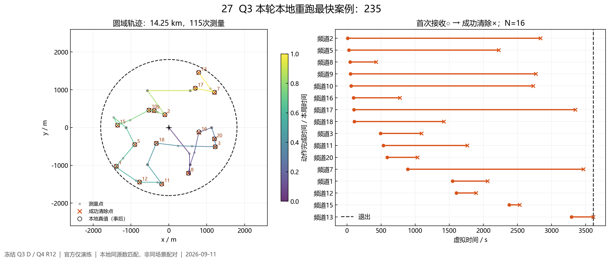

## 28 Q3 本轮本地重跑中位附近案例：72

问题：具体路径如何形成该局成绩？

读法与实测信息：该局288.492秒/源，3173.413秒，11.977km；无信号88/121。轨迹颜色随虚拟时间推进；时间线按首次接收排序，长度包含等待调度及后续定位。

边界：最快/中位附近/最慢按本批成绩预定规则选取，非随机代表；直线段只连接指令目标点。官方清除点不是精确源坐标，时间线长度也不是纯定位计算时间。

数据：data/traces.json → q3_local_72; data/targets.json

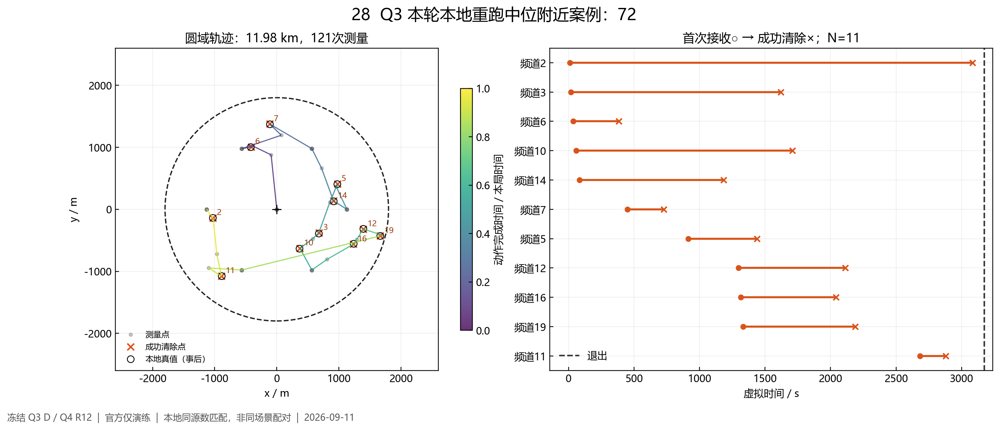

## 29 Q3 本轮本地重跑最慢案例：258

问题：具体路径如何形成该局成绩？

读法与实测信息：该局370.834秒/源，3708.337秒，14.802km；无信号92/117。轨迹颜色随虚拟时间推进；时间线按首次接收排序，长度包含等待调度及后续定位。

边界：最快/中位附近/最慢按本批成绩预定规则选取，非随机代表；直线段只连接指令目标点。官方清除点不是精确源坐标，时间线长度也不是纯定位计算时间。

数据：data/traces.json → q3_local_258; data/targets.json

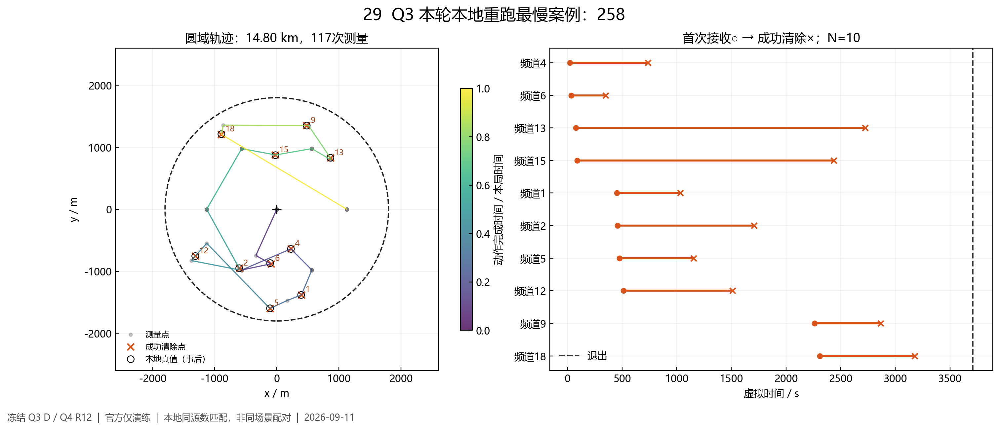

## 30 Q4 官方演练最快案例：JR45-AGUS-98WS-Z2HE

问题：具体路径如何形成该局成绩？

读法与实测信息：该局228.030秒/源，3648.477秒，14.992km；无信号47/96。轨迹颜色随虚拟时间推进；时间线按首次接收排序，长度包含等待调度及后续定位。

边界：最快/中位附近/最慢按本批成绩预定规则选取，非随机代表；直线段只连接指令目标点。官方清除点不是精确源坐标，时间线长度也不是纯定位计算时间。

数据：data/traces.json → q4_official_JR45-AGUS-98WS-Z2HE; data/targets.json

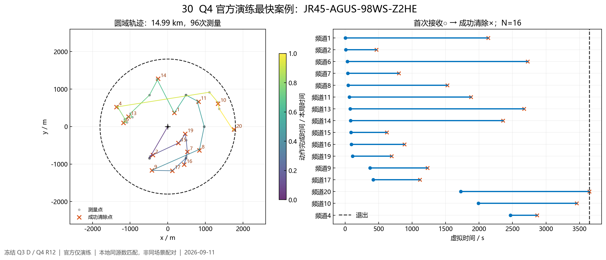

## 31 Q4 官方演练中位附近案例：SE28-AX3Y-4X5V-2JQV

问题：具体路径如何形成该局成绩？

读法与实测信息：该局541.530秒/源，7039.889秒，26.619km；无信号238/279。轨迹颜色随虚拟时间推进；时间线按首次接收排序，长度包含等待调度及后续定位。

边界：最快/中位附近/最慢按本批成绩预定规则选取，非随机代表；直线段只连接指令目标点。官方清除点不是精确源坐标，时间线长度也不是纯定位计算时间。

数据：data/traces.json → q4_official_SE28-AX3Y-4X5V-2JQV; data/targets.json

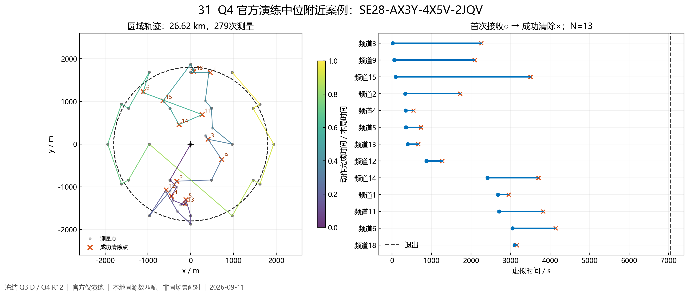

## 32 Q4 官方演练最慢案例：NM4A-2FWB-WXR9-7HMX

问题：具体路径如何形成该局成绩？

读法与实测信息：该局738.649秒/源，7386.491秒，25.342km；无信号347/382。轨迹颜色随虚拟时间推进；时间线按首次接收排序，长度包含等待调度及后续定位。

边界：最快/中位附近/最慢按本批成绩预定规则选取，非随机代表；直线段只连接指令目标点。官方清除点不是精确源坐标，时间线长度也不是纯定位计算时间。

数据：data/traces.json → q4_official_NM4A-2FWB-WXR9-7HMX; data/targets.json

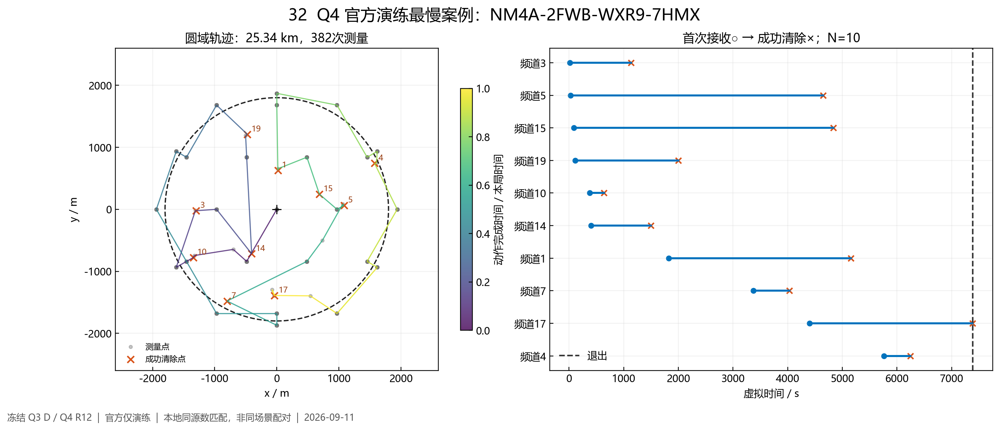

## 33 Q4 本轮本地重跑最快案例：331

问题：具体路径如何形成该局成绩？

读法与实测信息：该局295.157秒/源，4722.508秒，18.113km；无信号127/173。轨迹颜色随虚拟时间推进；时间线按首次接收排序，长度包含等待调度及后续定位。

边界：最快/中位附近/最慢按本批成绩预定规则选取，非随机代表；直线段只连接指令目标点。官方清除点不是精确源坐标，时间线长度也不是纯定位计算时间。

数据：data/traces.json → q4_local_331; data/targets.json

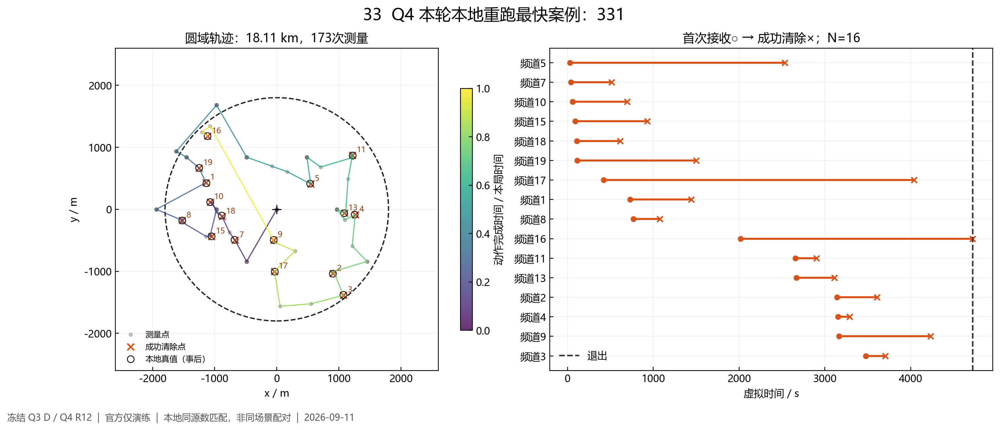

## 34 Q4 本轮本地重跑中位附近案例：446

问题：具体路径如何形成该局成绩？

读法与实测信息：该局541.226秒/源，8659.621秒，33.668km；无信号264/313。轨迹颜色随虚拟时间推进；时间线按首次接收排序，长度包含等待调度及后续定位。

边界：最快/中位附近/最慢按本批成绩预定规则选取，非随机代表；直线段只连接指令目标点。官方清除点不是精确源坐标，时间线长度也不是纯定位计算时间。

数据：data/traces.json → q4_local_446; data/targets.json

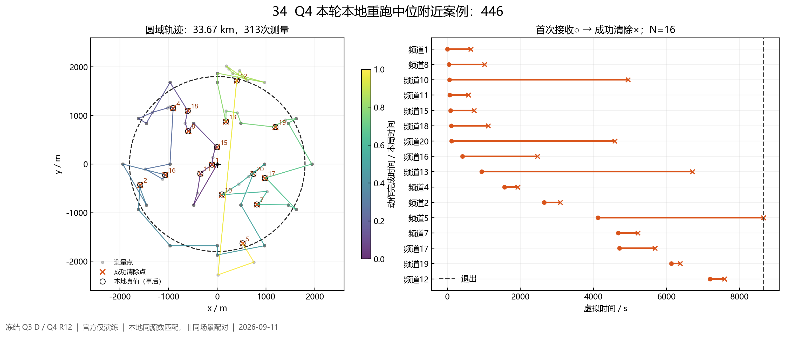

## 35 Q4 本轮本地重跑最慢案例：189

问题：具体路径如何形成该局成绩？

读法与实测信息：该局789.567秒/源，7895.666秒，27.398km；无信号363/398。轨迹颜色随虚拟时间推进；时间线按首次接收排序，长度包含等待调度及后续定位。

边界：最快/中位附近/最慢按本批成绩预定规则选取，非随机代表；直线段只连接指令目标点。官方清除点不是精确源坐标，时间线长度也不是纯定位计算时间。

数据：data/traces.json → q4_local_189; data/targets.json

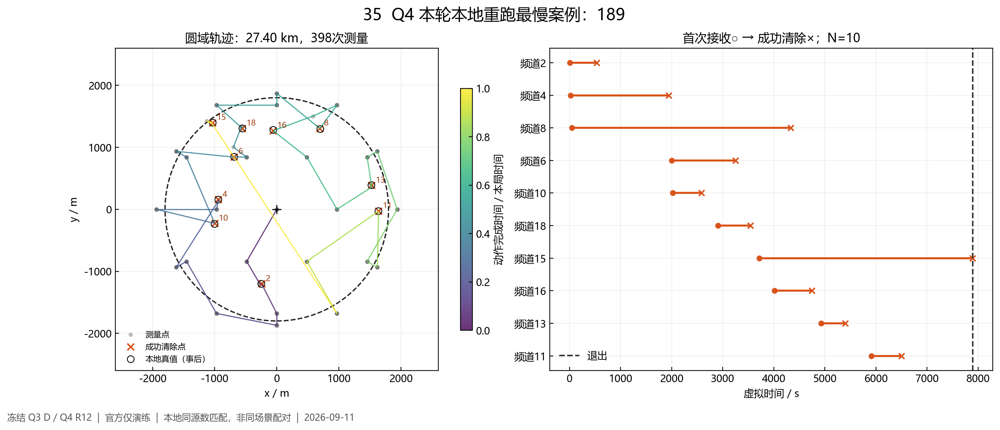

